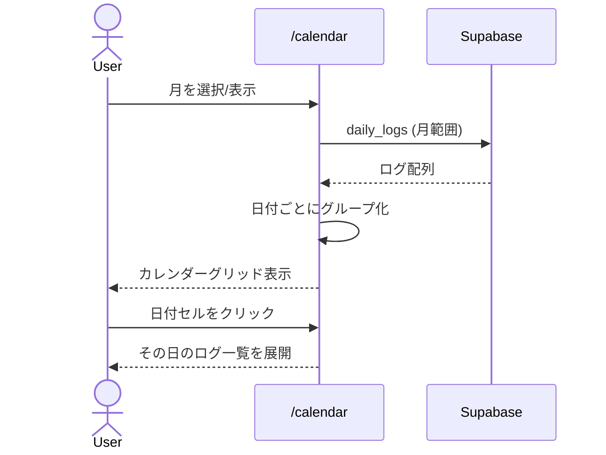
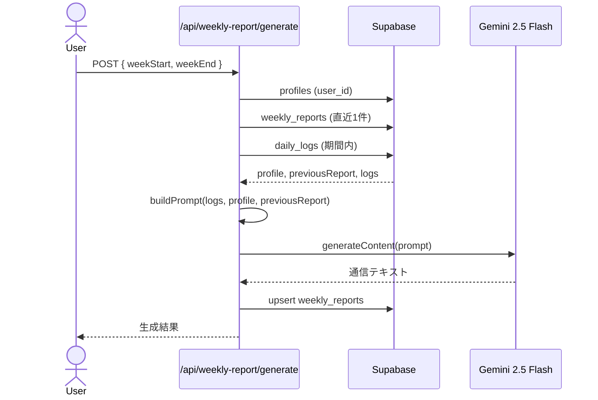

# 設計: カレンダービュー & 週次通信クオリティ改善

---

## 1. カレンダービュー

### 1.1 ルーティング

```
/calendar          — カレンダー画面（月表示 + 選択日のログ一覧）
```

ナビゲーションを更新：

```ts
// nav.tsx
const navItems = [
  { href: "/", label: "きょう" },
  { href: "/calendar", label: "カレンダー" },   // 追加
  { href: "/logs", label: "きろく" },
  { href: "/weekly", label: "通信" },
];
```

### 1.2 コンポーネント構成

```
src/app/(main)/calendar/page.tsx      — カレンダーページ（データフェッチ + 状態管理）
src/components/calendar/
  ├── calendar-grid.tsx               — 月次グリッド表示（純粋な表示コンポーネント）
  └── calendar-day-cell.tsx           — 日付セル（emoji表示 + クリック）
```

### 1.3 データ取得戦略

月単位で daily_logs を一括取得し、クライアント側で日付ごとにグループ化する。

```ts
// calendar/page.tsx
const { data } = await supabase
  .from("daily_logs")
  .select("id, log_date, mood, text")  // 軽量カラムのみ
  .gte("log_date", monthStart)         // "2026-02-01"
  .lte("log_date", monthEnd)           // "2026-02-28"
  .order("created_at", { ascending: true });
```

月をまたぐ場合も、表示カレンダーの最初の月曜〜最後の日曜のデータを取得する。

### 1.4 カレンダーグリッド設計

date-fns を利用したグリッド生成：

```ts
import { startOfMonth, endOfMonth, startOfWeek, endOfWeek,
         eachDayOfInterval, isSameMonth, isToday } from "date-fns";

function getCalendarDays(year: number, month: number): Date[] {
  const monthStart = startOfMonth(new Date(year, month));
  const monthEnd = endOfMonth(monthStart);
  const calStart = startOfWeek(monthStart, { weekStartsOn: 1 });
  const calEnd = endOfWeek(monthEnd, { weekStartsOn: 1 });
  return eachDayOfInterval({ start: calStart, end: calEnd });
}
```

これで常に月曜始まり、42日分（6行×7列）のグリッドが生成される。

### 1.5 日付セルの表示ロジック

```
┌─────────────────────────────────────────────────────────────┐
│  月   火   水   木   金   土   日                           │
│ ┌───┐┌───┐┌───┐┌───┐┌───┐┌───┐┌───┐                      │
│ │ 2 ││ 3 ││ 4 ││ 5 ││ 6 ││ 7 ││ 8 │                      │
│ │   ││🙂 ││😐 ││   ││🙂 ││   ││   │                      │
│ │   ││   ││②  ││   ││   ││   ││   │  ← ②はログ数バッジ   │
│ └───┘└───┘└───┘└───┘└───┘└───┘└───┘                      │
└─────────────────────────────────────────────────────────────┘
```

- ログなし: 日付数字のみ
- ログ1件: 気分 emoji 表示
- ログ複数: 最初の気分 emoji + ログ数バッジ
- 当月外の日: opacity 低下
- 今日: プライマリ色のリング/ドット
- 選択日: プライマリ色背景

### 1.6 選択日のログ展開

日付セルクリック → 下部にログ一覧をスライドイン表示。
既存の `LogCard` コンポーネントを再利用（ただし編集・削除は非表示にするか、
ログ一覧ページへのリンクを設ける）。

### 1.7 デザイン（手帳と封筒）

- カレンダーグリッドは手帳のマス目風（細いボーダー、温かみのあるbg）
- ヘッダー（年月+前月/次月）は明朝体
- 曜日ヘッダーは小さなアルファベット（Mon, Tue, ...）
- セルホバーで微妙なアクセントカラー背景

---

## 2. 週次通信クオリティ改善

### 2.1 profiles テーブル（新規）

#### マイグレーション SQL

```sql
CREATE TABLE profiles (
  id uuid PRIMARY KEY DEFAULT gen_random_uuid(),
  user_id uuid NOT NULL UNIQUE REFERENCES auth.users(id) ON DELETE CASCADE,
  child_name text,
  child_birth_date date,
  created_at timestamptz NOT NULL DEFAULT now(),
  updated_at timestamptz NOT NULL DEFAULT now()
);

CREATE INDEX idx_profiles_user ON profiles(user_id);

ALTER TABLE profiles ENABLE ROW LEVEL SECURITY;

CREATE POLICY select_own_profile ON profiles
  FOR SELECT USING (auth.uid() = user_id);
CREATE POLICY insert_own_profile ON profiles
  FOR INSERT WITH CHECK (auth.uid() = user_id);
CREATE POLICY update_own_profile ON profiles
  FOR UPDATE USING (auth.uid() = user_id);

CREATE TRIGGER profiles_updated_at
  BEFORE UPDATE ON profiles
  FOR EACH ROW EXECUTE FUNCTION update_updated_at();
```

#### TypeScript 型定義

```ts
// database.ts に追加
profiles: {
  Row: {
    id: string;
    user_id: string;
    child_name: string | null;
    child_birth_date: string | null;
    created_at: string;
    updated_at: string;
  };
  Insert: { ... };
  Update: { ... };
};

// types/index.ts に追加
export type Profile = Database["public"]["Tables"]["profiles"]["Row"];
```

### 2.2 設定画面

```
/settings          — プロフィール設定ページ
```

ナビゲーション: ヘッダーに小さなアイコンボタン（歯車 or ⚙）で遷移。

#### コンポーネント

```
src/app/(main)/settings/page.tsx      — 設定ページ
src/schemas/profile.ts                — プロフィールフォームスキーマ
```

フォーム項目：
- **お子さまの名前** (text, 任意)
- **お子さまの生年月日** (date input, 任意)

初回アクセス時に profiles レコードが存在しなければ自動作成（upsert）。

### 2.3 LLM モデル変更

```ts
// src/lib/gemini/client.ts
- return genAI.getGenerativeModel({ model: "gemini-2.0-flash" });
+ return genAI.getGenerativeModel({ model: "gemini-2.5-flash" });
```

### 2.4 プロンプト改善設計

#### 改善後のプロンプト構成

```
[役割設定]
あなたは育児日記「すくすく日記」の専属ライターです。
親が1日1日書き残した育児ログを読み、その週の出来事を
「温かみのある手紙」として紡ぎ出してください。

[背景情報]（※プロフィール情報があれば注入）
お子さまの名前: ○○ちゃん
月齢: 生後○ヶ月○日

[前回の通信]（※前回通信があれば注入）
前回の週次通信の最後の段落:
「（前回の結びの文）」

[思考指示 — 出力には含めない]
まず以下を考えてから通信を書いてください：
1. 今週のログ全体を読み、最も印象的なエピソードは何か？
2. 複数のログに共通するテーマや変化の兆しはあるか？
3. 前回からの成長や変化で注目すべき点はあるか？
4. 親の気持ちの変化はどうか？

[文体ガイドライン]
- 語り手は「育児日記の書き手」。親しみやすい敬体（です・ます調）。
- 単なる出来事の羅列ではなく、エピソードを「ストーリー」として紡ぐ。
- 冒頭は、今週を象徴する一場面やひとことから始める。
- 具体的な描写を大切に。「嬉しかった」ではなく、何がどう嬉しかったかを書く。
- ログにない出来事を推測して書かないこと。ログの内容のみを元にする。
- 最後は前向きな一文で締める。
- 500〜800字程度。

[構成ガイド — 自由構成]
以下のセクションは参考例です。ログの内容に合わせて
最適な構成を自分で選んでください。
見出し付きの箇条書きと自然な散文を自由に組み合わせてOK。

構成例A: テーマ型（今週のテーマを1つ選び深く書く）
構成例B: ダイジェスト型（日ごとのハイライトを短く紡ぐ）
構成例C: 成長ストーリー型（週の始まりと終わりの変化を軸に）

[出力フォーマット]
以下のヘッダーで始めてください：
📮 すくすく日記 ○月○日〜○月○日

本文はそのまま続けてください。セクション見出しには
絵文字1つ+見出しテキストを使ってください。

[今週のログ]
（ログデータ）
```

#### 月齢計算ユーティリティ

```ts
// src/lib/date.ts に追加
export function calcAge(birthDate: string | Date, targetDate: Date = new Date()): string {
  const birth = typeof birthDate === "string" ? parseISO(birthDate) : birthDate;
  const months = differenceInMonths(targetDate, birth);
  const years = Math.floor(months / 12);
  const remainingMonths = months % 12;
  if (years > 0) return `${years}歳${remainingMonths}ヶ月`;
  return `生後${months}ヶ月`;
}
```

### 2.5 生成 API の変更

`src/app/api/weekly-report/generate/route.ts` の処理フローを拡張：

```
1. 認証チェック
2. リクエストバリデーション
3. プロフィール取得（profiles テーブル）      ← 追加
4. 前回の通信取得（直近1件の weekly_reports）  ← 追加
5. 対象期間のログ取得
6. buildPrompt に profile + previousReport を渡す ← 変更
7. LLM で生成
8. upsert で保存
```

#### buildPrompt の引数拡張

```ts
export function buildPrompt(
  logs: DailyLog[],
  weekStart: string,
  weekEnd: string,
  profile?: { childName?: string; childBirthDate?: string } | null,
  previousReport?: string | null,
): string { ... }
```

### 2.6 影響範囲

| ファイル | 変更内容 |
|---------|---------|
| `supabase/migrations/20260220000000_add_profiles.sql` | 新規: profiles テーブル |
| `src/types/database.ts` | profiles テーブル型追加 |
| `src/types/index.ts` | Profile 型エクスポート |
| `src/lib/gemini/client.ts` | モデルを 2.5-flash に変更 |
| `src/lib/date.ts` | calcAge 関数追加 |
| `src/lib/weekly-report/prompt.ts` | プロンプト全面改修 |
| `src/lib/weekly-report/generate.ts` | 引数拡張（profile, previousReport） |
| `src/app/api/weekly-report/generate/route.ts` | profile・前回通信の取得追加 |
| `src/schemas/profile.ts` | 新規: プロフィールフォームスキーマ |
| `src/app/(main)/settings/page.tsx` | 新規: 設定画面 |
| `src/components/layout/header.tsx` | 設定ボタン追加 |
| `src/components/layout/nav.tsx` | カレンダーメニュー追加 |
| `src/app/(main)/calendar/page.tsx` | 新規: カレンダーページ |
| `src/components/calendar/calendar-grid.tsx` | 新規: グリッドコンポーネント |
| `src/components/calendar/calendar-day-cell.tsx` | 新規: 日付セルコンポーネント |

---

## 3. データフロー図

### カレンダー



### 週次通信生成


