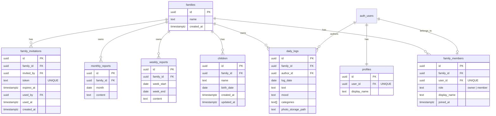

# 家族グループ機能 — 設計書

## 1. データモデル

### 1-1. 新規テーブル

#### `families`
家族の単位。全データの所有者。

| カラム | 型 | 制約 | 説明 |
|--------|------|------|------|
| id | uuid | PK, DEFAULT gen_random_uuid() | |
| name | text | NOT NULL | 家族名（例: "田中家"） |
| created_at | timestamptz | NOT NULL DEFAULT now() | |

#### `family_members`
ユーザーと家族の紐付け。

| カラム | 型 | 制約 | 説明 |
|--------|------|------|------|
| id | uuid | PK, DEFAULT gen_random_uuid() | |
| family_id | uuid | NOT NULL FK → families(id) ON DELETE CASCADE | |
| user_id | uuid | NOT NULL UNIQUE FK → auth.users(id) ON DELETE CASCADE | 1ユーザー=1家族 |
| role | text | NOT NULL CHECK (role IN ('owner', 'member')) | |
| display_name | text | | メンバー表示名（例: "パパ", "ママ"） |
| joined_at | timestamptz | NOT NULL DEFAULT now() | |

**UNIQUE(user_id)** — 1ユーザーは同時に1つの家族にのみ所属。

#### `children`
子どもの情報。`profiles.child_name/child_birth_date` から移行。

| カラム | 型 | 制約 | 説明 |
|--------|------|------|------|
| id | uuid | PK, DEFAULT gen_random_uuid() | |
| family_id | uuid | NOT NULL FK → families(id) ON DELETE CASCADE | |
| name | text | | |
| birth_date | date | | |
| created_at | timestamptz | NOT NULL DEFAULT now() | |
| updated_at | timestamptz | NOT NULL DEFAULT now() | |

きょうだい対応の構造だが、UIは当面1人目のみ。

#### `family_invitations`
招待リンク管理。

| カラム | 型 | 制約 | 説明 |
|--------|------|------|------|
| id | uuid | PK, DEFAULT gen_random_uuid() | |
| family_id | uuid | NOT NULL FK → families(id) ON DELETE CASCADE | |
| invited_by | uuid | NOT NULL FK → auth.users(id) | 招待者 |
| token | text | NOT NULL UNIQUE | URLに含めるランダムトークン |
| expires_at | timestamptz | NOT NULL | 作成から7日後 |
| used_by | uuid | FK → auth.users(id) | 使用したユーザー |
| used_at | timestamptz | | |
| created_at | timestamptz | NOT NULL DEFAULT now() | |

### 1-2. 既存テーブルの変更

#### `daily_logs`
```
変更前: user_id uuid NOT NULL REFERENCES auth.users(id)
変更後: family_id uuid NOT NULL REFERENCES families(id) ON DELETE CASCADE
        author_id uuid NOT NULL REFERENCES auth.users(id)
```
- `user_id` → `author_id` にリネーム（書いた人）
- `family_id` を追加（所属する家族）
- インデックス: `idx_daily_logs_family_date (family_id, log_date)` に変更
- 既存データ: user_id → author_id, 自動作成された family の id → family_id

#### `weekly_reports`
```
変更前: user_id uuid NOT NULL REFERENCES auth.users(id)
変更後: family_id uuid NOT NULL REFERENCES families(id) ON DELETE CASCADE
```
- `user_id` → `family_id` に変更
- UNIQUE 制約: `(user_id, week_start)` → `(family_id, week_start)`
- インデックス: `idx_weekly_reports_family_week (family_id, week_start)`

#### `monthly_reports`
```
変更前: user_id uuid NOT NULL REFERENCES auth.users(id)
変更後: family_id uuid NOT NULL REFERENCES families(id) ON DELETE CASCADE
```
- `user_id` → `family_id` に変更
- UNIQUE 制約: `(user_id, month)` → `(family_id, month)`
- インデックス: `idx_monthly_reports_family_month (family_id, month)`

#### `profiles`
```
削除: child_name, child_birth_date（children テーブルに移行）
追加: display_name text（ユーザーの表示名。family_members.display_name とは別）
```
- `child_name`, `child_birth_date` は `children` テーブルに移行後、カラム削除

### 1-3. ER図（変更後）



## 2. RLS ポリシー設計

全テーブルで「自分が所属する家族」を基準にアクセス制御する。
ヘルパー関数を作成して各ポリシーから参照する。

### 2-1. ヘルパー関数

```sql
-- 現在のユーザーが所属する family_id を返す
CREATE OR REPLACE FUNCTION my_family_id()
RETURNS uuid AS $$
  SELECT family_id FROM family_members WHERE user_id = auth.uid() LIMIT 1;
$$ LANGUAGE sql SECURITY DEFINER STABLE;
```

### 2-2. ポリシー一覧

#### `families`
| 操作 | 条件 |
|------|------|
| SELECT | `id = my_family_id()` |
| UPDATE | `id = my_family_id()` AND オーナーのみ（サブクエリ） |

#### `family_members`
| 操作 | 条件 |
|------|------|
| SELECT | `family_id = my_family_id()` |
| INSERT | owner のみ（招待受諾APIはサービスロールで処理） |
| DELETE | owner による削除 OR 自分自身の脱退 |

#### `children`
| 操作 | 条件 |
|------|------|
| SELECT | `family_id = my_family_id()` |
| INSERT | `family_id = my_family_id()` |
| UPDATE | `family_id = my_family_id()` |

#### `daily_logs`
| 操作 | 条件 |
|------|------|
| SELECT | `family_id = my_family_id()` |
| INSERT | `family_id = my_family_id()` AND `author_id = auth.uid()` |
| UPDATE | `author_id = auth.uid()`（自分が書いたもののみ） |
| DELETE | `author_id = auth.uid()`（自分が書いたもののみ） |

#### `weekly_reports`, `monthly_reports`
| 操作 | 条件 |
|------|------|
| SELECT | `family_id = my_family_id()` |
| INSERT | `family_id = my_family_id()` |
| UPDATE | `family_id = my_family_id()` |

#### `family_invitations`
| 操作 | 条件 |
|------|------|
| SELECT | `family_id = my_family_id()` |
| INSERT | `family_id = my_family_id()` AND owner |
| UPDATE | なし（サービスロールで処理） |

#### `profiles`
| 操作 | 条件 |
|------|------|
| SELECT | `user_id = auth.uid()` OR 同じ家族のメンバー |
| INSERT | `user_id = auth.uid()` |
| UPDATE | `user_id = auth.uid()` |

## 3. 認証・オンボーディングフロー

### 3-1. 新規登録時（通常フロー）

```
サインアップ → メール確認 → 初回ログイン
  → middleware が family_members を確認
  → 未所属 → /onboarding にリダイレクト
  → オンボーディング画面:
     1. 家族名を入力（例: "田中家"）
     2. あなたの表示名（例: "パパ"）
     3. お子さまの名前・生年月日
  → families + family_members(owner) + children + profiles 作成
  → / (ホーム) へリダイレクト
```

### 3-2. 招待から参加するフロー

```
招待リンク /invite/[token] にアクセス
  → 未ログイン → /signup?invite=[token] にリダイレクト（トークンを保持）
  → ログイン済み → 招待受諾API呼び出し
     1. トークン検証（有効期限・未使用）
     2. family_members(member) に追加
     3. invitation に used_by, used_at を記録
     4. profiles 作成（未作成の場合）
  → / (ホーム) へリダイレクト
```

### 3-3. middleware の変更

現在の middleware は「未認証 → /login」のリダイレクトのみ。
以下を追加:

- 認証済み + 家族未所属 + `/onboarding` 以外 → `/onboarding` にリダイレクト
- 認証済み + 家族所属済み + `/onboarding` → `/` にリダイレクト
- `/invite/[token]` は認証不要ページに追加

## 4. API設計

### 4-1. 新規APIルート

#### `POST /api/family/create`
オンボーディング時の家族作成。

```typescript
// Request
{
  familyName: string;      // "田中家"
  displayName: string;     // "パパ"
  childName?: string;      // "さくた"
  childBirthDate?: string; // "2025-08-01"
}

// Response
{ family: Family; child: Child; }
```

処理:
1. families INSERT
2. family_members INSERT (role: 'owner')
3. children INSERT（入力があれば）
4. profiles UPSERT (display_name)

#### `POST /api/family/invite`
招待リンク発行。owner のみ。

```typescript
// Request: なし（family_id はセッションから取得）

// Response
{ token: string; expiresAt: string; inviteUrl: string; }
```

#### `POST /api/family/join`
招待受諾。

```typescript
// Request
{ token: string; displayName?: string; }

// Response
{ family: Family; }
```

処理（サービスロールで実行）:
1. トークン検証
2. 家族メンバー数チェック（上限5人）
3. family_members INSERT (role: 'member')
4. invitation UPDATE (used_by, used_at)
5. profiles UPSERT

#### `GET /api/family/members`
家族メンバー一覧取得。

#### `DELETE /api/family/members/[userId]`
メンバー削除。owner のみ。

### 4-2. 既存APIルートの変更

#### `POST /api/weekly-report/generate`
- `user_id` → `family_id` でログ取得
- `user_id` → `family_id` で upsert
- `family_id` はセッションユーザーの所属家族から取得

#### `POST /api/monthly-report/generate`
- 同上の変更

### 4-3. family_id 取得ヘルパー

多くの API で「現在のユーザーの family_id」を取得する処理が共通するため、ヘルパー関数を作成:

```typescript
// src/lib/supabase/family.ts
export async function getMyFamilyId(supabase: SupabaseClient): Promise<string | null> {
  const { data } = await supabase
    .from("family_members")
    .select("family_id")
    .single();
  return data?.family_id ?? null;
}
```

RLS により `auth.uid()` のレコードのみ返るため、user_id 指定は不要。

## 5. コンポーネント設計

### 5-1. 新規ページ

#### `/onboarding` — オンボーディング
- ステップ形式（家族名 → 表示名 → お子さま情報）
- 招待トークン付きの場合はスキップ（参加フローへ）

#### `/invite/[token]` — 招待受諾
- トークン検証 → 家族名表示 → 「参加する」ボタン
- 未ログインの場合はサインアップ/ログインへ誘導

#### `/settings/family` — 家族設定（設定画面内に統合も可）
- メンバー一覧（表示名 + ロール）
- 招待リンク発行ボタン（owner のみ）
- メンバー削除（owner のみ）
- 家族名編集（owner のみ）

### 5-2. 既存ページの変更

#### 設定画面 `/settings`
- 「お子さまの情報」セクション → `children` テーブルから読み書きに変更
- 「家族」セクションを追加（`/settings/family` へのリンク、またはインラインで表示）
- 「あなたの情報」セクション追加（display_name の編集）

#### ホーム `/` (日次ログ)
- ログ一覧で author の表示名を表示（自分以外のメンバーが書いたログの場合）
- ログフォーム送信時に `family_id` と `author_id` をセット

#### カレンダー `/calendar`
- 全家族メンバーのログを表示
- ログの書き手がわかるバッジ or アイコン表示

#### 通信ページ `/weekly`
- 変更なし（family_id ベースの取得はRLSが自動的に処理）

#### ログ一覧 `/logs`
- 全家族メンバーのログを表示
- author 表示名のバッジ追加

### 5-3. 書き手表示コンポーネント

```typescript
// src/components/log/author-badge.tsx
type AuthorBadgeProps = {
  authorId: string;
  displayName: string;
  isOwn: boolean; // 自分が書いたログか
};
```

自分のログには表示せず、パートナーのログにのみ「パパ」「ママ」等のバッジを表示。

## 6. Storage パス変更

現在: `logs/{userId}/{logId}/{filename}`
変更後: `logs/{familyId}/{logId}/{filename}`

- RLS ポリシーも family_id ベースに変更
- 既存データは移行スクリプトでパス変更

## 7. マイグレーション戦略

既存ユーザーのデータを安全に移行するため、1本のマイグレーションで以下を実行:

```
1. 新規テーブル作成（families, family_members, children, family_invitations）
2. 既存ユーザーごとに family を自動作成
   - families: name = 'マイファミリー'
   - family_members: role = 'owner'
3. profiles → children にデータコピー
4. daily_logs: user_id → author_id リネーム、family_id カラム追加＆データ埋め
5. weekly_reports: user_id → family_id に変更＆データ埋め
6. monthly_reports: user_id → family_id に変更＆データ埋め
7. profiles から child_name, child_birth_date を削除、display_name 追加
8. 旧 RLS ポリシー DROP → 新 RLS ポリシー CREATE
9. インデックス再作成
10. Storage ポリシー更新
```

## 8. 型定義の変更

### database.ts に追加する型

- `families` — Row / Insert / Update
- `family_members` — Row / Insert / Update
- `children` — Row / Insert / Update
- `family_invitations` — Row / Insert / Update

### database.ts で変更する型

- `daily_logs` — `user_id` → `family_id` + `author_id`
- `weekly_reports` — `user_id` → `family_id`
- `monthly_reports` — `user_id` → `family_id`
- `profiles` — `child_name`, `child_birth_date` 削除、`display_name` 追加

### index.ts に追加するエクスポート

```typescript
export type Family = Database["public"]["Tables"]["families"]["Row"];
export type FamilyMember = Database["public"]["Tables"]["family_members"]["Row"];
export type Child = Database["public"]["Tables"]["children"]["Row"];
export type FamilyInvitation = Database["public"]["Tables"]["family_invitations"]["Row"];
```

## 9. 影響ファイル一覧

### 新規ファイル
| ファイル | 説明 |
|----------|------|
| `supabase/migrations/20260223000000_add_family_group.sql` | マイグレーション |
| `src/lib/supabase/family.ts` | family_id 取得ヘルパー |
| `src/app/(auth)/onboarding/page.tsx` | オンボーディング |
| `src/app/invite/[token]/page.tsx` | 招待受諾 |
| `src/app/api/family/create/route.ts` | 家族作成API |
| `src/app/api/family/invite/route.ts` | 招待リンクAPI |
| `src/app/api/family/join/route.ts` | 招待受諾API |
| `src/app/api/family/members/route.ts` | メンバー一覧API |
| `src/app/api/family/members/[userId]/route.ts` | メンバー削除API |
| `src/components/log/author-badge.tsx` | 書き手バッジ |
| `src/components/family/member-list.tsx` | メンバー一覧 |
| `src/components/family/invite-link.tsx` | 招待リンクUI |
| `src/schemas/family.ts` | バリデーションスキーマ |

### 変更ファイル
| ファイル | 変更内容 |
|----------|----------|
| `src/types/database.ts` | 全テーブル型の更新 |
| `src/types/index.ts` | 新しい型のエクスポート |
| `src/middleware.ts` | オンボーディングリダイレクト追加 |
| `src/app/auth/callback/route.ts` | 招待トークン引き継ぎ |
| `src/app/(auth)/signup/page.tsx` | 招待トークンパラメータ対応 |
| `src/app/(main)/page.tsx` | family_id + author_id 対応、書き手表示 |
| `src/app/(main)/settings/page.tsx` | children テーブル対応、家族設定追加 |
| `src/app/(main)/logs/page.tsx` | 書き手表示 |
| `src/app/(main)/calendar/page.tsx` | 書き手表示 |
| `src/app/api/weekly-report/generate/route.ts` | family_id ベース |
| `src/app/api/monthly-report/generate/route.ts` | family_id ベース |
| `src/lib/weekly-report/prompt.ts` | children テーブルからの情報取得 |
| `src/lib/monthly-report/prompt.ts` | 同上 |
| `src/components/log/log-form.tsx` | family_id + author_id セット |
| `src/components/log/log-card.tsx` | 書き手バッジ表示 |
| `src/schemas/profile.ts` | child_name/child_birth_date 削除、display_name 追加 |
| `docs/functional-design.md` | ER図・データモデル更新 |
| `docs/product-requirements.md` | 家族グループ機能追加 |
| `docs/glossary.md` | 用語追加 |
