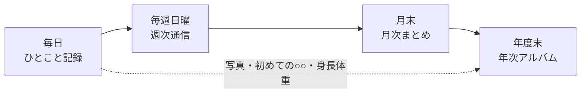

# すくすく日記（baby-weekly-letter）

> 毎日はひとことだけ。週末には、わが家だけの「通信」が届く。

すくすく日記は、日々の育児をかんたんに書き残しておくと、週に 1 回 AI が「ちょい感動系」の**週次通信**にまとめてくれる Web アプリです。
PC・スマホのブラウザで使えて、PWA としてホーム画面にも追加できます。

## コンセプト

### なぜつくったのか

育児中の親は、毎日が忙しすぎて出来事を書き残す余裕がありません。書いたとしても読み返す機会がなく、「いつ寝返りしたんだっけ」と記憶はすぐに薄れていきます。
そして育児日記は、入力が面倒でたいてい続きません。

すくすく日記は、この「書けない・読み返さない・続かない」を解くためにつくりました。

### 大事にしていること

**1. 書くのは、ひとことでいい**

記録に必要なのは、短い本文と気分スタンプ（🥰🙂😐😴😭）だけです。カテゴリや写真はあってもなくても構いません。両手がふさがっているときは、マイクに話すだけで記録できます。
上手な文章を書く必要はありません。文章にするのは AI の仕事です。

**2. 価値は「記録」ではなく「思い出」にある**

ログをためること自体は目的ではありません。書きためたひとことが、週末に 1 通の手紙のような読みものになって返ってくる。その体験がこのアプリの中心です。
週次通信は月次まとめに、月次まとめは年次アルバムにつながり、1 年たつと子どもの成長が 1 冊にまとまります。

**3. 家族みんなで見守る**

記録は家族で共有できます。パートナーの記録にスタンプやひとことを返したり、できあがった通信を PDF や画像にして祖父母に送ったり。
「見てるよ」が伝わることが、記録を続ける力になります。

### 「ちょい感動系」とは

大げさな感動ではなく、読み返したときに少し胸があたたかくなる、くらいの温度感です。週次通信は次のような方針で書かれます。

- 出来事を並べるのではなく、その週をひとつの**物語**として書く
- 「嬉しかった」で終わらせず、何がどう嬉しかったのかを具体的に描く
- ログに**書かれていないことは書かない**（推測で話を盛らない）
- **前回の通信の続き**として書き、週をまたいだつながりを持たせる
- 最後は前向きな一文で締めくくる

## 記録から思い出までの流れ



| タイミング | できあがるもの | 材料 |
| --- | --- | --- |
| 毎日 | 日次ログ | 本文・気分・カテゴリ・写真 |
| 毎週日曜 | 週次通信 | その週の日次ログ ＋ 前回の通信 |
| 月末 | 月次まとめ | その月の週次通信 |
| 年度末（3/31） | 年次アルバム | 1 年分の月次まとめ・週次通信・写真・はじめてできたこと・身長体重 |

通信は子どもごとに作られます。決まった日に自動で生成されるので、ボタンを押し忘れても大丈夫です（手動でも生成できます）。

## 週次通信のかたち

通信は、好きな文体とセクションを組み合わせて自分たちらしくできます。

| 文体 | 雰囲気 |
| --- | --- |
| ほっこり系（既定） | 温かみのある手紙 |
| ユーモア系 | 思わず笑顔になる、軽快な手紙 |
| 淡々記録系 | 事実を中心にした、落ち着いた記録 |
| ポエム系 | 情景や五感を描く、詩的なエッセイ |

| セクション | 内容 |
| --- | --- |
| ✨ 今週のハイライト | いちばん印象的だったエピソードを掘り下げる |
| 📅 日々のダイジェスト | 日ごとの出来事を短くつなぐ |
| 🌱 成長メモ | 前回の通信からの変化や成長 |
| 💌 親へのひとこと | 書き手である親への労いと応援 |
| 💬 今週の名言 | ログの中の印象的なひとことを引用する |

既定ではハイライト・ダイジェスト・成長メモの 3 つが入ります。

## 主な機能

### 記録する

- **日次ログ**: 本文・気分スタンプ・カテゴリ・写真 1 枚で記録。同じ日に何件でも残せます
- **音声入力**: マイクボタンで話した内容を文字にします
- **からだの記録**: 身長・体重（成長曲線つき）、体温、睡眠、食事をワンタップで記録
- **はじめてできたこと**: 記録に「✨ はじめてできたこと」を付けると成長タイムラインに並び、年次アルバムにも載ります
- **記録リマインダー**: その日の記録がないと 21 時に通知します

### 振り返る

- **週次通信 / 月次まとめ / 年次アルバム**: 上で紹介した AI による読みもの
- **エクスポート**: 週次・月次は A4 の PDF か PNG 画像、年次アルバムは A4 の PDF で保存できます
- **○年前の今日**: 1 年以上前の同じ日の記録をホーム画面に表示
- **写真ギャラリー / カレンダー**: 写真を月ごとに一覧でき、記録した日をひと目で確認できます
- **統計ダッシュボード**: 気分・カテゴリ・成長・体温・睡眠・食事の傾向をグラフで表示

### 家族で使う

- **家族グループ**: 招待リンクで家族を招き、記録を共有。子どもは何人でも登録できます
- **リアクション・コメント**: 記録に 5 種類のスタンプ（❤️👏😊💪✨）や短いコメントを送れます

## 技術スタック

| 分類 | 技術 |
| --- | --- |
| フレームワーク | Next.js 16（App Router）/ React 19 / TypeScript 5 |
| UI | Tailwind CSS 4 / shadcn/ui（Radix UI）/ lucide-react / sonner |
| フォーム・検証 | React Hook Form / Zod 4 |
| グラフ・出力 | Recharts / html-to-image / jsPDF |
| バックエンド | Supabase（Auth / PostgreSQL + RLS / Storage）/ Next.js Route Handlers |
| AI | Google Gemini（既定は `gemini-3.8-flash`）/ `@google/generative-ai` |
| 通知 | Web Push（`web-push` + Service Worker） |
| ホスティング | Vercel（Vercel Cron）/ GitHub Actions |
| 開発ツール | pnpm / ESLint / Prettier / Vitest / Testing Library |

構成図や認証フローは [docs/architecture.md](docs/architecture.md) にあります。

## ディレクトリ構成

```
.
├── src/
│   ├── app/            # App Router（(auth) 認証画面 / (main) メイン画面 / api Route Handlers）
│   ├── components/     # 機能ごとの UI コンポーネント（ui/ は shadcn/ui）
│   ├── hooks/          # カスタムフック
│   ├── lib/            # Supabase・Gemini・レポート生成・cron などのロジック
│   ├── schemas/        # Zod スキーマ
│   └── types/          # 型定義とドメイン定数
├── __tests__/          # Vitest のテスト（src/ と同じ構成）
├── supabase/migrations/# DB スキーマ・RLS・Storage のマイグレーション
├── public/             # PWA マニフェスト・Service Worker・アイコン
├── docs/               # 設計ドキュメント
└── .steering/          # 作業単位のステアリング資料
```

詳しくは [docs/repository-structure.md](docs/repository-structure.md) を参照してください。

## ドキュメント

| ドキュメント | 内容 |
| --- | --- |
| [docs/product-requirements.md](docs/product-requirements.md) | プロダクト要求（目的・機能一覧・受け入れ条件） |
| [docs/functional-design.md](docs/functional-design.md) | 機能設計（画面・データモデル・API） |
| [docs/architecture.md](docs/architecture.md) | 技術仕様（構成・環境変数・セキュリティ） |
| [docs/repository-structure.md](docs/repository-structure.md) | リポジトリ構造 |
| [docs/development-guidelines.md](docs/development-guidelines.md) | 開発ガイドライン（コーディング・テスト・Git 規約） |
| [docs/glossary.md](docs/glossary.md) | 用語集 |
