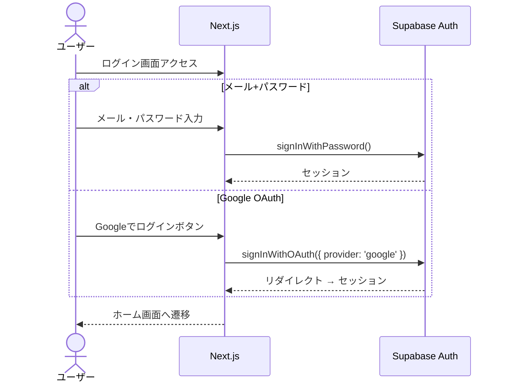

# 技術仕様書

## 1. テクノロジースタック

### 1.1 フロントエンド

| 技術 | バージョン | 用途 |
|------|-----------|------|
| Next.js | 16 (App Router) | フレームワーク |
| React | 19 | UIライブラリ |
| TypeScript | 5.x | 型安全な開発 |
| Tailwind CSS | 4 | スタイリング |
| shadcn/ui | latest | UIコンポーネント |
| React Hook Form | latest | フォーム管理 |
| Zod | latest | バリデーション |
| date-fns | latest | 日付操作 |
| Recharts | latest | グラフ・チャート描画 |
| html-to-image | latest | DOM→画像変換（エクスポート機能） |
| jsPDF | latest | PDF生成（エクスポート機能） |
| lucide-react | latest | アイコン |
| sonner | latest | トースト通知 |

### 1.2 バックエンド

| 技術 | 用途 |
|------|------|
| Supabase Auth | 認証（メール+パスワード / Google OAuth） |
| Supabase Database | PostgreSQL データベース |
| Supabase Storage | 写真保存 |
| Next.js Route Handlers | API エンドポイント |

### 1.3 AI / LLM

| 技術 | 用途 |
|------|------|
| Google Gemini 2.5 Flash | 週次・月次通信の文章生成 |
| @google/generative-ai | Gemini SDK |

### 1.4 インフラ / デプロイ

| 技術 | 用途 |
|------|------|
| Vercel | ホスティング・デプロイ |
| GitHub | ソースコード管理 |

### 1.5 開発ツール

| 技術 | 用途 |
|------|------|
| pnpm | パッケージマネージャ |
| ESLint | リンター |
| Prettier | フォーマッター |
| Vitest | テストフレームワーク |

---

## 2. システムアーキテクチャ

### 2.1 全体構成

```
┌──────────────────────────────────────────┐
│                 Vercel                    │
│                                          │
│  ┌────────────────────────────────────┐  │
│  │          Next.js App Router        │  │
│  │                                    │  │
│  │  ┌──────────┐  ┌───────────────┐  │  │
│  │  │  Pages   │  │ Route Handlers│  │  │
│  │  │ (SSR/CSR)│  │   (API)       │  │  │
│  │  └────┬─────┘  └───────┬───────┘  │  │
│  │       │                │          │  │
│  └───────┼────────────────┼──────────┘  │
│          │                │              │
└──────────┼────────────────┼──────────────┘
           │                │
           ▼                ▼
┌─────────────────┐  ┌──────────────┐
│    Supabase     │  │ Google Gemini│
│  Auth / DB /    │  │  2.5 Flash   │
│  Storage        │  │              │
└─────────────────┘  └──────────────┘
```

### 2.2 レンダリング戦略

| 画面 | レンダリング | 理由 |
|------|-------------|------|
| ログイン / 登録 | CSR | 認証フォームはクライアント操作 |
| オンボーディング | CSR | 初期設定フォーム |
| ホーム（ログ入力） | CSR | フォーム操作・リアルタイム表示 |
| カレンダー | CSR | ユーザー固有データのため |
| 記録一覧 | CSR | ユーザー固有データのため |
| 写真ギャラリー | CSR | ユーザー固有データのため |
| 統計ダッシュボード | CSR | ユーザー固有データのため |
| 週次通信詳細 | CSR | ユーザー固有データのため |
| 月次まとめ詳細 | CSR | ユーザー固有データのため |
| 家族管理 | CSR | ユーザー固有データのため |
| 設定 | CSR | ユーザー固有データのため |

全画面がユーザー固有データを扱うため、CSR（Client Side Rendering）を基本とする。

### 2.3 認証フロー



### 2.4 Supabase Client 構成

```
lib/
├── supabase/
│   ├── client.ts      # ブラウザ用 Supabase Client
│   ├── server.ts      # サーバー用 Supabase Client（Route Handler用）
│   └── middleware.ts   # 認証ミドルウェア（セッション管理）
```

- ブラウザ用: `createBrowserClient()` を使用
- サーバー用: `createServerClient()` を使用（Route Handler内でのDB操作）
- ミドルウェア: 全リクエストでセッションをリフレッシュ

---

## 3. 環境変数

| 変数名 | 用途 | 設定場所 |
|--------|------|---------|
| NEXT_PUBLIC_SUPABASE_URL | Supabase プロジェクトURL | Vercel / .env.local |
| NEXT_PUBLIC_SUPABASE_ANON_KEY | Supabase 匿名キー | Vercel / .env.local |
| SUPABASE_SERVICE_ROLE_KEY | Supabase サービスロールキー | Vercel のみ |
| GEMINI_API_KEY | Google Gemini APIキー | Vercel のみ |

- `NEXT_PUBLIC_` プレフィックスのある変数のみクライアントに公開
- `SUPABASE_SERVICE_ROLE_KEY` と `GEMINI_API_KEY` はサーバーサイドのみ

---

## 4. 技術的制約と要件

### 4.1 ブラウザサポート

- モダンブラウザ（Chrome, Safari, Firefox, Edge の最新2バージョン）
- モバイルブラウザ（iOS Safari, Android Chrome）

### 4.2 レスポンシブ対応

- モバイルファースト設計
- ブレークポイント: Tailwind CSS のデフォルト（sm: 640px, md: 768px, lg: 1024px）
- 主要操作はスマホで完結できること

### 4.3 写真アップロード

- 対応フォーマット: JPEG, PNG, WebP
- 最大ファイルサイズ: 5MB（MVP）
- クライアント側リサイズ: MVP では不要

### 4.4 API レート制限

- Gemini API: 週次通信生成は週1回程度のため、制限に抵触しない
- Supabase: 無料枠で十分（50,000行、1GB Storage）

---

## 5. パフォーマンス要件

MVP段階では厳密なパフォーマンス目標は設定しないが、以下を意識する：

| 項目 | 目安 |
|------|------|
| 初期ページロード | 3秒以内 |
| ログ保存 | 1秒以内（ネットワーク環境依存） |
| 週次通信生成 | 10秒以内（LLM応答時間依存） |
| 写真アップロード | 5秒以内（ファイルサイズ・回線依存） |

---

## 6. セキュリティ要件

| 項目 | 対策 |
|------|------|
| 認証 | Supabase Auth によるセッション管理 |
| 認可 | RLS による行レベルセキュリティ |
| APIキー保護 | Gemini APIキーはサーバーサイドのみ |
| XSS | React のデフォルトエスケープ + 生成テキストのサニタイズ |
| CSRF | Supabase Auth のトークンベース認証 |
| ファイルアップロード | ファイルタイプ・サイズのバリデーション |

---

## 7. エラーハンドリング方針

| エラー種別 | 対応 |
|-----------|------|
| 認証エラー | ログイン画面へリダイレクト |
| バリデーションエラー | フォーム上にエラーメッセージ表示 |
| DB操作エラー | トースト通知でエラーを表示 |
| LLM生成エラー | 「生成に失敗しました。再度お試しください」表示 |
| 写真アップロードエラー | トースト通知でエラーを表示 |
| ネットワークエラー | トースト通知でリトライを促す |
