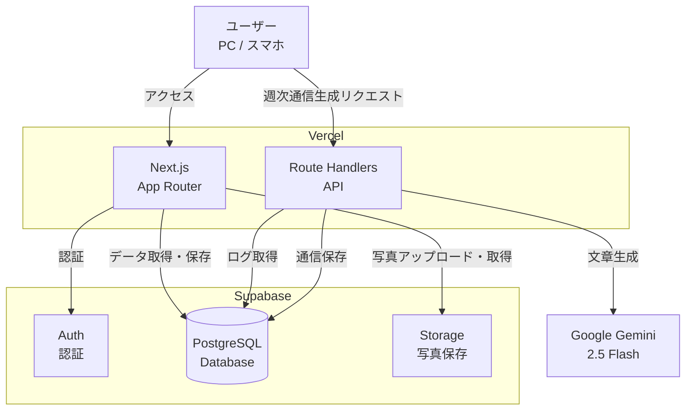
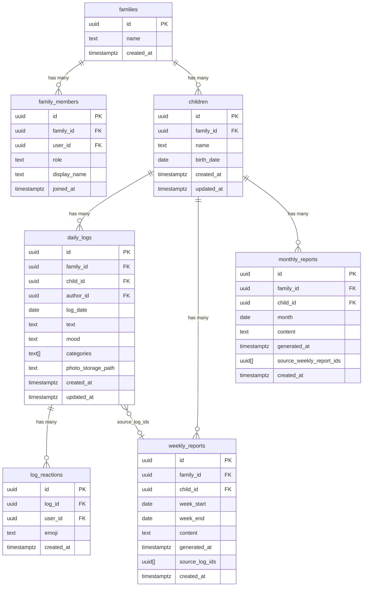
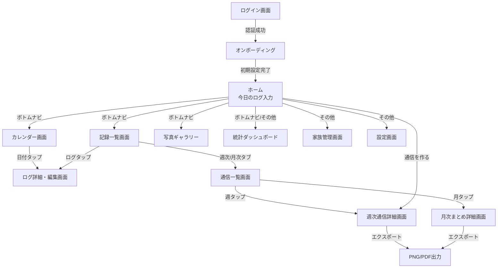
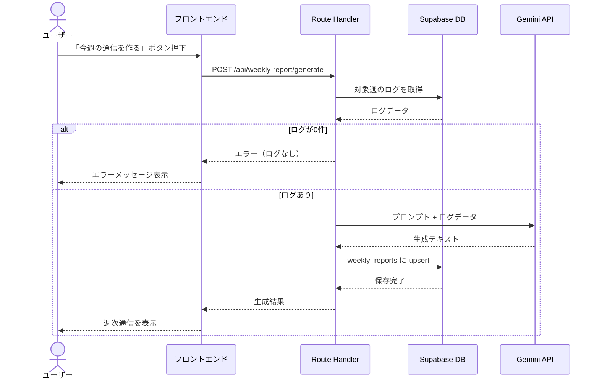

# 機能設計書

## 1. システム構成図



---

## 2. データモデル定義

### 2.1 ER図



### 2.2 テーブル詳細

#### children

| カラム | 型 | NULL | デフォルト | 備考 |
|--------|-----|------|-----------|------|
| id | uuid | NOT NULL | gen_random_uuid() | PK |
| family_id | uuid | NOT NULL | | FK → families |
| name | text | NULL | | 子供の名前 |
| birth_date | date | NULL | | 生年月日 |
| created_at | timestamptz | NOT NULL | now() | |
| updated_at | timestamptz | NOT NULL | now() | |

- インデックス: (family_id)
- RLS: family_id がユーザーの所属する家族と一致

#### daily_logs

| カラム | 型 | NULL | デフォルト | 備考 |
|--------|-----|------|-----------|------|
| id | uuid | NOT NULL | gen_random_uuid() | PK |
| family_id | uuid | NOT NULL | | FK → families |
| child_id | uuid | NOT NULL | | FK → children（対象の子供） |
| author_id | uuid | NOT NULL | auth.uid() | FK → auth.users |
| log_date | date | NOT NULL | CURRENT_DATE | ログ対象日 |
| text | text | NOT NULL | | フリーテキスト |
| mood | text | NOT NULL | | moved / happy / neutral / tired / sad |
| categories | text[] | NULL | '{}' | カテゴリ配列 |
| photo_storage_path | text | NULL | | Storage上のパス |
| created_at | timestamptz | NOT NULL | now() | |
| updated_at | timestamptz | NOT NULL | now() | |

- インデックス: (family_id, log_date), (child_id)
- RLS: family_id がユーザーの所属する家族と一致

#### weekly_reports

| カラム | 型 | NULL | デフォルト | 備考 |
|--------|-----|------|-----------|------|
| id | uuid | NOT NULL | gen_random_uuid() | PK |
| family_id | uuid | NOT NULL | | FK → families |
| child_id | uuid | NOT NULL | | FK → children（対象の子供） |
| week_start | date | NOT NULL | | 月曜日 |
| week_end | date | NOT NULL | | 日曜日 |
| content | text | NOT NULL | | 生成された通信本文 |
| generated_at | timestamptz | NOT NULL | now() | 生成日時 |
| source_log_ids | uuid[] | NULL | '{}' | 元ログID配列 |
| created_at | timestamptz | NOT NULL | now() | |

- ユニーク制約: (family_id, child_id, week_start)
- インデックス: (family_id, child_id, week_start)
- RLS: family_id がユーザーの所属する家族と一致

#### monthly_reports

| カラム | 型 | NULL | デフォルト | 備考 |
|--------|-----|------|-----------|------|
| id | uuid | NOT NULL | gen_random_uuid() | PK |
| family_id | uuid | NOT NULL | | FK → families |
| child_id | uuid | NOT NULL | | FK → children（対象の子供） |
| month | date | NOT NULL | | 対象月 |
| content | text | NOT NULL | | 生成された月次まとめ本文 |
| generated_at | timestamptz | NOT NULL | now() | 生成日時 |
| source_weekly_report_ids | uuid[] | NULL | '{}' | 元週次通信ID配列 |
| created_at | timestamptz | NOT NULL | now() | |

- ユニーク制約: (family_id, child_id, month)
- RLS: family_id がユーザーの所属する家族と一致

#### log_reactions

| カラム | 型 | NULL | デフォルト | 備考 |
|--------|-----|------|-----------|------|
| id | uuid | NOT NULL | gen_random_uuid() | PK |
| log_id | uuid | NOT NULL | | FK → daily_logs（ON DELETE CASCADE） |
| user_id | uuid | NOT NULL | | FK → auth.users |
| emoji | text | NOT NULL | | リアクション絵文字 |
| created_at | timestamptz | NOT NULL | now() | |

- ユニーク制約: (log_id, user_id, emoji)
- RLS: 家族スコープ（daily_logs 経由で family_id を参照）

---

## 3. RLS（Row Level Security）ポリシー

全テーブルで `my_family_id()` 関数を使用した家族単位のアクセス制御を実施。

```sql
CREATE FUNCTION my_family_id() RETURNS uuid AS $$
  SELECT family_id FROM family_members WHERE user_id = auth.uid() LIMIT 1;
$$ LANGUAGE sql SECURITY DEFINER STABLE;
```

### daily_logs

| 操作 | ポリシー名 | 条件 |
|------|-----------|------|
| SELECT | select_family_logs | family_id = my_family_id() |
| INSERT | insert_family_logs | family_id = my_family_id() AND author_id = auth.uid() |
| UPDATE | update_own_logs | author_id = auth.uid() |
| DELETE | delete_own_logs | author_id = auth.uid() |

### weekly_reports

| 操作 | ポリシー名 | 条件 |
|------|-----------|------|
| SELECT | select_family_reports | family_id = my_family_id() |
| INSERT | insert_family_reports | family_id = my_family_id() |
| UPDATE | update_family_reports | family_id = my_family_id() |

### monthly_reports

| 操作 | ポリシー名 | 条件 |
|------|-----------|------|
| SELECT | select_family_reports | family_id = my_family_id() |
| INSERT | insert_family_reports | family_id = my_family_id() |
| UPDATE | update_family_reports | family_id = my_family_id() |

### log_reactions

| 操作 | ポリシー名 | 条件 |
|------|-----------|------|
| SELECT | select_family_reactions | daily_logs JOIN で family_id = my_family_id() |
| INSERT | insert_own_reactions | user_id = auth.uid() AND daily_logs JOIN で family_id = my_family_id() |
| DELETE | delete_own_reactions | user_id = auth.uid() |

### Storage (log-photos バケット)

| 操作 | 条件 |
|------|------|
| SELECT | パスが `logs/{auth.uid()}/` で始まる |
| INSERT | パスが `logs/{auth.uid()}/` で始まる |
| DELETE | パスが `logs/{auth.uid()}/` で始まる |

---

## 4. API設計

### 4.1 日次ログ API（Supabase Client 直接操作）

クライアントから Supabase Client SDK を使って直接操作する。Route Handlers は使用しない。

| 操作 | メソッド | 対象テーブル |
|------|---------|-------------|
| ログ作成 | supabase.from('daily_logs').insert() | daily_logs |
| ログ一覧取得 | supabase.from('daily_logs').select().eq('log_date', date) | daily_logs |
| ログ更新 | supabase.from('daily_logs').update().eq('id', id) | daily_logs |
| ログ削除 | supabase.from('daily_logs').delete().eq('id', id) | daily_logs |

### 4.2 写真 API（Supabase Client 直接操作）

| 操作 | メソッド |
|------|---------|
| アップロード | supabase.storage.from('log-photos').upload(path, file) |
| URL取得 | supabase.storage.from('log-photos').getPublicUrl(path) |
| 削除 | supabase.storage.from('log-photos').remove([path]) |

### 4.3 週次通信 API（Route Handlers）

#### POST /api/weekly-report/generate

週次通信を生成する。

**リクエスト:**

```json
{
  "childId": "uuid",
  "weekStart": "2026-02-16",
  "weekEnd": "2026-02-22"
}
```

**処理フロー:**

1. 認証チェック（Supabase Auth セッション検証）
2. 指定された child_id の対象期間のログを取得
3. ログが0件の場合はエラーを返す
4. Gemini API にプロンプト + ログデータを送信
5. 生成結果を weekly_reports に upsert（child_id + week_start で上書き）
6. 生成結果を返す

**レスポンス（成功）:**

```json
{
  "id": "uuid",
  "weekStart": "2026-02-16",
  "weekEnd": "2026-02-22",
  "content": "📮 今週のすくすく日記（2026/02/16〜2026/02/22）...",
  "generatedAt": "2026-02-22T21:00:00Z"
}
```

**レスポンス（エラー）:**

```json
{
  "error": "対象期間のログがありません"
}
```

#### GET /api/weekly-report

週次通信の一覧・個別取得はSupabase Client で直接操作する。

| 操作 | メソッド |
|------|---------|
| 一覧取得 | supabase.from('weekly_reports').select().order('week_start', { ascending: false }) |
| 個別取得 | supabase.from('weekly_reports').select().eq('id', id).single() |

### 4.4 月次まとめ API（Route Handlers）

#### POST /api/monthly-report/generate

月次まとめを生成する。対象月の週次通信をもとにAIで月単位の振り返りを生成。

**リクエスト:**

```json
{
  "childId": "uuid",
  "month": "2026-02"
}
```

### 4.5 家族 API（Route Handlers）

| エンドポイント | メソッド | 用途 |
|---------------|---------|------|
| /api/family/create | POST | 家族グループ作成 |
| /api/family/invite | POST | 招待リンク生成 |
| /api/family/join | POST | 招待受け入れ |
| /api/family/members | GET | メンバー一覧取得 |
| /api/family/members/[userId] | PATCH/DELETE | メンバー操作 |

### 4.6 リアクション API（Supabase Client 直接操作）

| 操作 | メソッド |
|------|---------|
| リアクション追加 | supabase.from('log_reactions').insert({ log_id, user_id, emoji }) |
| リアクション削除 | supabase.from('log_reactions').delete().match({ log_id, user_id, emoji }) |
| 一覧取得 | supabase.from('log_reactions').select().in('log_id', logIds) |

---

## 5. 画面遷移図



---

## 6. 画面設計（ワイヤフレーム）

### 6.1 ログイン画面

```
┌─────────────────────────────┐
│                             │
│       すくすく日記           │
│                             │
│  ┌───────────────────────┐  │
│  │ メールアドレス         │  │
│  └───────────────────────┘  │
│  ┌───────────────────────┐  │
│  │ パスワード             │  │
│  └───────────────────────┘  │
│                             │
│  ┌───────────────────────┐  │
│  │    ログイン            │  │
│  └───────────────────────┘  │
│                             │
│  ┌───────────────────────┐  │
│  │  G  Googleでログイン   │  │
│  └───────────────────────┘  │
│                             │
│  アカウント登録はこちら      │
│                             │
└─────────────────────────────┘
```

### 6.2 ホーム画面（今日のログ入力）

```
┌─────────────────────────────┐
│ すくすく日記    [ログ] [通信] │
├─────────────────────────────┤
│                             │
│ 📅 2026年2月18日（水）       │
│                             │
│ 今日の気分                   │
│ [🙂] [😐] [😭]              │
│                             │
│ 今日の出来事                 │
│ ┌───────────────────────┐   │
│ │                       │   │
│ │                       │   │
│ │                       │   │
│ └───────────────────────┘   │
│                             │
│ カテゴリ                     │
│ [食事] [睡眠] [遊び] [ことば]│
│ [運動] [体調] [成長] [気持ち]│
│                             │
│ 写真                        │
│ [📷 写真を追加]              │
│                             │
│ ┌───────────────────────┐   │
│ │       保存する          │   │
│ └───────────────────────┘   │
│                             │
│ ── 今日のログ ──            │
│ ┌───────────────────────┐   │
│ │ 🙂 離乳食をよく食べた… │   │
│ └───────────────────────┘   │
│                             │
└─────────────────────────────┘
```

### 6.3 ログ一覧画面

```
┌─────────────────────────────┐
│ ← ログ一覧                  │
├─────────────────────────────┤
│                             │
│ 2026年2月                   │
│                             │
│ ┌───────────────────────┐   │
│ │ 2/18（水） 🙂          │   │
│ │ 離乳食をよく食べた…    │   │
│ │ [食事] [成長]          │   │
│ └───────────────────────┘   │
│ ┌───────────────────────┐   │
│ │ 2/17（火） 😐          │   │
│ │ 夜泣きがひどかった…    │   │
│ │ [睡眠] [体調]          │   │
│ └───────────────────────┘   │
│ ┌───────────────────────┐   │
│ │ 2/16（月） 🙂          │   │
│ │ 初めて「ママ」と言った… │   │
│ │ [ことば] [成長]        │   │
│ └───────────────────────┘   │
│                             │
│ ...                         │
│                             │
└─────────────────────────────┘
```

### 6.4 週次通信詳細画面

```
┌─────────────────────────────┐
│ ← 週次通信                  │
├─────────────────────────────┤
│                             │
│ 📮 今週のすくすく日記        │
│ 2026/02/10〜2026/02/16      │
│                             │
│ 今週は離乳食デビューの       │
│ 大きな一歩がありました…     │
│                             │
│ 🌱 成長のきざし              │
│ ・初めてスプーンを自分で…   │
│ ・寝返りが上手に…           │
│                             │
│ 😊 かわいかった瞬間          │
│ ・パパの顔を見て…           │
│                             │
│ 🫧 ちょっと大変だったこと    │
│ ・夜泣きが続いて…           │
│                             │
│ 🧡 パパ/ママのひとこと       │
│ 大変だけど、笑顔に救われる   │
│ 毎日です。                  │
│                             │
│ ── この週の写真 ──          │
│ ┌─────┐ ┌─────┐ ┌─────┐   │
│ │ 📷  │ │ 📷  │ │ 📷  │   │
│ └─────┘ └─────┘ └─────┘   │
│                             │
│ ┌───────────────────────┐   │
│ │     再生成する          │   │
│ └───────────────────────┘   │
│                             │
└─────────────────────────────┘
```

### 6.5 週次通信一覧画面

```
┌─────────────────────────────┐
│ ← 週次通信一覧              │
├─────────────────────────────┤
│                             │
│ ┌───────────────────────┐   │
│ │ 📮 2/10〜2/16          │   │
│ │ 離乳食デビューの週…    │   │
│ └───────────────────────┘   │
│ ┌───────────────────────┐   │
│ │ 📮 2/3〜2/9            │   │
│ │ 寝返りマスターの週…    │   │
│ └───────────────────────┘   │
│ ┌───────────────────────┐   │
│ │ 📮 1/27〜2/2           │   │
│ │ 初めての笑い声の週…    │   │
│ └───────────────────────┘   │
│                             │
│ ...                         │
│                             │
└─────────────────────────────┘
```

---

## 7. コンポーネント設計

### 7.1 主要コンポーネント

```
app/
├── (auth)/
│   ├── login/page.tsx          # ログイン画面
│   ├── signup/page.tsx         # アカウント登録画面
│   └── onboarding/page.tsx     # オンボーディング（家族・子供初期設定）
├── (main)/
│   ├── layout.tsx              # メインレイアウト（ヘッダー・ナビ）
│   ├── page.tsx                # ホーム（今日のログ入力）
│   ├── calendar/page.tsx       # カレンダー画面
│   ├── logs/page.tsx           # 記録一覧画面（ログ・週次・月次タブ）
│   ├── gallery/page.tsx        # 写真ギャラリー画面
│   ├── stats/page.tsx          # 統計ダッシュボード画面
│   ├── family/page.tsx         # 家族管理画面
│   ├── settings/page.tsx       # 設定画面
│   └── weekly/
│       ├── page.tsx            # 週次通信一覧画面（リダイレクト）
│       ├── [id]/page.tsx       # 週次通信詳細画面
│       └── monthly/
│           └── [id]/page.tsx   # 月次まとめ詳細画面
├── invite/
│   └── [token]/page.tsx        # 家族招待受け入れ画面
└── api/
    ├── weekly-report/
    │   └── generate/route.ts   # 週次通信生成 API
    ├── monthly-report/
    │   └── generate/route.ts   # 月次まとめ生成 API
    └── family/
        ├── create/route.ts     # 家族作成 API
        ├── invite/route.ts     # 招待リンク生成 API
        ├── join/route.ts       # 家族参加 API
        └── members/
            ├── route.ts        # メンバー一覧 API
            └── [userId]/route.ts # メンバー操作 API
```

### 7.2 共通コンポーネント

| コンポーネント | 配置 | 用途 |
|---------------|------|------|
| MoodSelector | `log/` | 気分スタンプ選択（🥰🙂😐😴😭） |
| CategoryPicker | `log/` | カテゴリ複数選択 |
| PhotoUploader | `log/` | 写真アップロード（プレビュー付き） |
| LogCard | `log/` | ログ一覧のカード表示（リアクションバー付き） |
| LogForm | `log/` | ログ入力・編集フォーム |
| LogFilter | `log/` | ログ絞り込み（気分・カテゴリ・テキスト・子供） |
| LogsTabs | `log/` | 記録一覧のタブ切り替え（ログ・週次・月次） |
| ReactionBar | `log/` | スタンプリアクション表示・トグル操作 |
| AuthorBadge | `log/` | 記録者の表示名バッジ |
| ChildSelector | `child/` | 子供選択（複数子供時にフォーム上部に表示） |
| ChildBadge | `child/` | 子供名バッジ（記録カードに表示） |
| WeeklyReportCard | `weekly/` | 週次通信一覧のカード表示 |
| PhotoGallery | `weekly/` | 写真一覧表示（週次通信詳細用） |
| MonthlyReportCard | `monthly/` | 月次まとめ一覧のカード表示 |
| MonthlyPhotoGallery | `monthly/` | 月次写真一覧表示 |
| CalendarGrid | `calendar/` | カレンダーグリッド表示 |
| MonthPicker | `calendar/` | 月選択ピッカー |
| PhotoGrid | `gallery/` | 写真ギャラリーのグリッド表示 |
| PhotoModal | `gallery/` | 写真拡大モーダル |
| MoodChart | `stats/` | 記録数・気分分布の積み上げ棒グラフ |
| CategoryPieChart | `stats/` | カテゴリ別割合の円グラフ |
| PeriodTabs | `stats/` | 統計の期間切り替えタブ |
| MemoriesSection | `memory/` | ○年前の今日セクション |
| MemoryCard | `memory/` | 過去の記録カード |
| ReactionNotice | `home/` | リアクション新着通知 |
| InviteLink | `family/` | 招待リンク生成・共有 |
| MemberList | `family/` | 家族メンバー一覧 |
| ExportLayout | `export/` | エクスポート用専用レイアウト |
| ShareMenu | `export/` | 共有メニュー（PNG/PDF選択） |
| Header | `layout/` | デスクトップヘッダー |
| Nav | `layout/` | デスクトップナビゲーション |
| BottomNav | `layout/` | モバイルボトムナビゲーション |

---

## 8. 週次通信生成フロー



---

## 9. v2 機能設計（実装済み）

### 9.1 写真ギャラリー

記録に添付された写真を一覧で振り返れる専用ページ。

- **画面**: `/gallery`
- **表示形式**: 月別のグリッドレイアウト（3列）
- **データソース**: `daily_logs` の `photo_storage_path` が存在するレコードを対象
- **操作**: 写真タップで拡大モーダル表示
- **フィルター**: 月切り替え（前後ナビゲーション）、子供切り替え
- **コンポーネント**: `PhotoGrid`, `PhotoModal`
- **ロジック**: `lib/gallery.ts`

### 9.2 過去の振り返り — ○年前の今日

ホーム画面に「○年前の今日」の記録を表示し、成長の実感と感動を提供する。

- **表示場所**: ホーム画面の今日のログ一覧の下部
- **データソース**: `daily_logs` から過去の同月同日のレコードを取得
- **表示条件**: 1年以上前の同日にログが存在する場合のみ表示
- **表示内容**: テキスト・気分・写真（あれば）をカード形式で表示
- **複数年**: 1年前、2年前…と複数年分がある場合はすべて表示
- **コンポーネント**: `MemoriesSection`, `MemoryCard`
- **ロジック**: `lib/memories.ts`

### 9.3 統計ダッシュボード

記録データを可視化し、育児の傾向と成長を実感できるダッシュボード。

- **画面**: `/stats`
- **グラフ種類**:
  - 記録数・気分分布の積み上げ棒グラフ（「記録の様子」）— 1つのグラフで記録数と気分の内訳を同時表示
  - カテゴリ別の記録割合（円グラフ）
- **期間**: 月/週単位で切り替え、前後ナビゲーション
- **フィルター**: 子供切り替え（複数子供時）
- **ライブラリ**: Recharts
- **コンポーネント**: `MoodChart`, `CategoryPieChart`, `PeriodTabs`
- **ロジック**: `lib/stats.ts`

### 9.4 家族間のリアクション

記録に対して家族メンバーがスタンプリアクションを残せる機能。

- **リアクション種類**: 固定5種のスタンプ
  - ❤️ いいね / 👏 すごい！ / 😊 ほっこり / 💪 おつかれさま / ✨ キラキラ
- **操作**: スタンプタップでトグル（追加/削除）。楽観的UIで即時反映
- **データモデル**: `log_reactions` テーブル（log_id, user_id, emoji, UNIQUE制約）
- **表示**: LogCard の下部にリアクションバーを常時表示。リアクション済みのスタンプはハイライト、リアクターの表示名を表示
- **通知**: ホーム画面にリアクション新着通知バナー（localStorage で最終確認時刻を管理）
- **コンポーネント**: `ReactionBar`, `ReactionNotice`
- **ロジック**: `lib/reactions.ts`

### 9.5 通信のPDF / 画像エクスポート

週次・月次通信をPDFや画像としてエクスポートし、共有・印刷できる機能。

- **エクスポート形式**: PNG（高解像度 2x）、PDF（A4縦）
- **生成方式**: クライアントサイドで `html-to-image` + `jsPDF` を使用（動的インポートでコード分割）
- **UI**: 通信詳細画面に共有ボタン → ドロップダウンメニューでPNG/PDF選択
- **レイアウト**: 専用の `ExportLayout` コンポーネント（800px固定幅、インラインスタイル）。通信本文 + 写真グリッド（3列）+ ヘッダー/フッター
- **コンポーネント**: `ExportLayout`, `ShareMenu`
- **ロジック**: `lib/export.ts`

### 9.6 モバイルナビゲーション改善（実装予定）

モバイルのボトムバーに「その他」メニューを追加し、統計・家族・設定・ログアウトへの導線を確保する。

- **ボトムバー構成**: 今日 / カレンダー / 記録 / 写真 / その他（5項目）
- **「その他」メニュー**: タップでボトムシートまたはドロワーを展開
  - 統計 / 家族 / 設定 / ログアウト
- **デスクトップ**: 既存のヘッダー構成を維持（変更なし）

### 9.7 テンプレート / クイック記録（将来検討）

よく使う記録パターンをワンタップで呼び出せる機能。

- **データモデル**: `log_templates` テーブル（family_id, label, icon, default_text, default_mood, default_categories, sort_order）
- **UI**: ホーム画面のフォーム上部にテンプレートボタン一覧を表示
- **設定**: 設定画面からテンプレートの追加・編集・削除・並び替え
- **デフォルト**: 初回登録時に5〜6個の汎用テンプレートをプリセット（ミルク、離乳食、お昼寝、おふろ等）
- **動作**: テンプレートタップでフォームにプリセット値を反映。ユーザーが編集してから保存も可能
