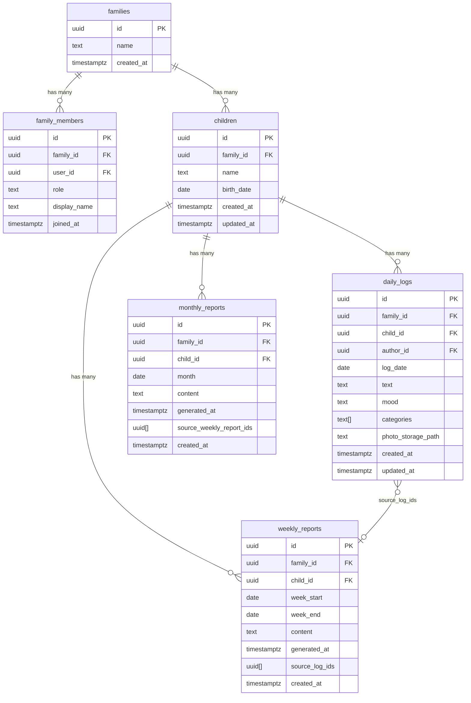
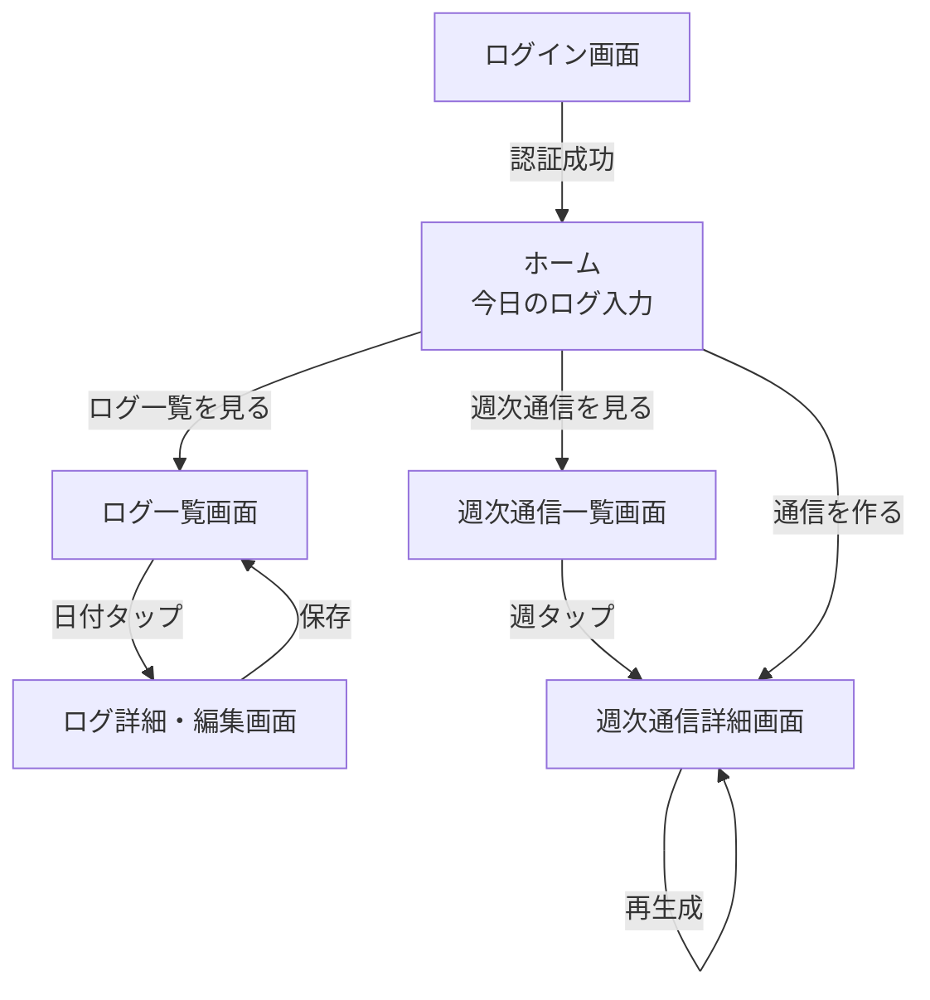
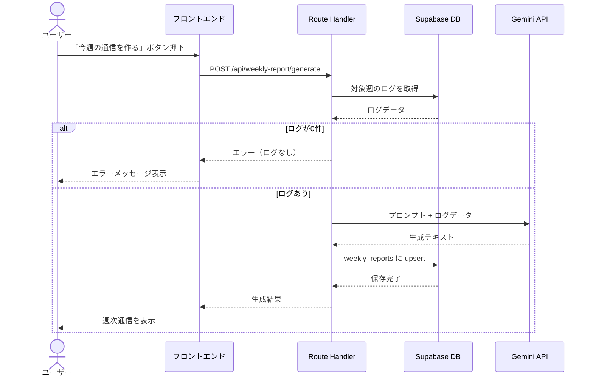

# 機能設計書

## 1. システム構成図


---

## 2. データモデル定義

### 2.1 ER図



### 2.2 テーブル詳細

#### children

| カラム | 型 | NULL | デフォルト | 備考 |
|--------|-----|------|-----------|------|
| id | uuid | NOT NULL | gen_random_uuid() | PK |
| family_id | uuid | NOT NULL | | FK → families |
| name | text | NULL | | 子供の名前 |
| birth_date | date | NULL | | 生年月日 |
| created_at | timestamptz | NOT NULL | now() | |
| updated_at | timestamptz | NOT NULL | now() | |

- インデックス: (family_id)
- RLS: family_id がユーザーの所属する家族と一致

#### daily_logs

| カラム | 型 | NULL | デフォルト | 備考 |
|--------|-----|------|-----------|------|
| id | uuid | NOT NULL | gen_random_uuid() | PK |
| family_id | uuid | NOT NULL | | FK → families |
| child_id | uuid | NOT NULL | | FK → children（対象の子供） |
| author_id | uuid | NOT NULL | auth.uid() | FK → auth.users |
| log_date | date | NOT NULL | CURRENT_DATE | ログ対象日 |
| text | text | NOT NULL | | フリーテキスト |
| mood | text | NOT NULL | | moved / happy / neutral / tired / sad |
| categories | text[] | NULL | '{}' | カテゴリ配列 |
| photo_storage_path | text | NULL | | Storage上のパス |
| created_at | timestamptz | NOT NULL | now() | |
| updated_at | timestamptz | NOT NULL | now() | |

- インデックス: (family_id, log_date), (child_id)
- RLS: family_id がユーザーの所属する家族と一致

#### weekly_reports

| カラム | 型 | NULL | デフォルト | 備考 |
|--------|-----|------|-----------|------|
| id | uuid | NOT NULL | gen_random_uuid() | PK |
| family_id | uuid | NOT NULL | | FK → families |
| child_id | uuid | NOT NULL | | FK → children（対象の子供） |
| week_start | date | NOT NULL | | 月曜日 |
| week_end | date | NOT NULL | | 日曜日 |
| content | text | NOT NULL | | 生成された通信本文 |
| generated_at | timestamptz | NOT NULL | now() | 生成日時 |
| source_log_ids | uuid[] | NULL | '{}' | 元ログID配列 |
| created_at | timestamptz | NOT NULL | now() | |

- ユニーク制約: (family_id, child_id, week_start)
- インデックス: (family_id, child_id, week_start)
- RLS: family_id がユーザーの所属する家族と一致

#### monthly_reports

| カラム | 型 | NULL | デフォルト | 備考 |
|--------|-----|------|-----------|------|
| id | uuid | NOT NULL | gen_random_uuid() | PK |
| family_id | uuid | NOT NULL | | FK → families |
| child_id | uuid | NOT NULL | | FK → children（対象の子供） |
| month | date | NOT NULL | | 対象月 |
| content | text | NOT NULL | | 生成された月次まとめ本文 |
| generated_at | timestamptz | NOT NULL | now() | 生成日時 |
| source_weekly_report_ids | uuid[] | NULL | '{}' | 元週次通信ID配列 |
| created_at | timestamptz | NOT NULL | now() | |

- ユニーク制約: (family_id, child_id, month)
- RLS: family_id がユーザーの所属する家族と一致

---

## 3. RLS（Row Level Security）ポリシー

### daily_logs

| 操作 | ポリシー名 | 条件 |
|------|-----------|------|
| SELECT | select_own_logs | user_id = auth.uid() |
| INSERT | insert_own_logs | user_id = auth.uid() |
| UPDATE | update_own_logs | user_id = auth.uid() |
| DELETE | delete_own_logs | user_id = auth.uid() |

### weekly_reports

| 操作 | ポリシー名 | 条件 |
|------|-----------|------|
| SELECT | select_own_reports | user_id = auth.uid() |
| INSERT | insert_own_reports | user_id = auth.uid() |
| UPDATE | update_own_reports | user_id = auth.uid() |

### Storage (log-photos バケット)

| 操作 | 条件 |
|------|------|
| SELECT | パスが `logs/{auth.uid()}/` で始まる |
| INSERT | パスが `logs/{auth.uid()}/` で始まる |
| DELETE | パスが `logs/{auth.uid()}/` で始まる |

---

## 4. API設計

### 4.1 日次ログ API（Supabase Client 直接操作）

クライアントから Supabase Client SDK を使って直接操作する。Route Handlers は使用しない。

| 操作 | メソッド | 対象テーブル |
|------|---------|-------------|
| ログ作成 | supabase.from('daily_logs').insert() | daily_logs |
| ログ一覧取得 | supabase.from('daily_logs').select().eq('log_date', date) | daily_logs |
| ログ更新 | supabase.from('daily_logs').update().eq('id', id) | daily_logs |
| ログ削除 | supabase.from('daily_logs').delete().eq('id', id) | daily_logs |

### 4.2 写真 API（Supabase Client 直接操作）

| 操作 | メソッド |
|------|---------|
| アップロード | supabase.storage.from('log-photos').upload(path, file) |
| URL取得 | supabase.storage.from('log-photos').getPublicUrl(path) |
| 削除 | supabase.storage.from('log-photos').remove([path]) |

### 4.3 週次通信 API（Route Handlers）

#### POST /api/weekly-report/generate

週次通信を生成する。

**リクエスト:**

```json
{
  "childId": "uuid",
  "weekStart": "2026-02-16",
  "weekEnd": "2026-02-22"
}
```

**処理フロー:**

1. 認証チェック（Supabase Auth セッション検証）
2. 指定された child_id の対象期間のログを取得
3. ログが0件の場合はエラーを返す
4. Gemini API にプロンプト + ログデータを送信
5. 生成結果を weekly_reports に upsert（child_id + week_start で上書き）
6. 生成結果を返す

**レスポンス（成功）:**

```json
{
  "id": "uuid",
  "weekStart": "2026-02-16",
  "weekEnd": "2026-02-22",
  "content": "📮 今週のすくすく日記（2026/02/16〜2026/02/22）...",
  "generatedAt": "2026-02-22T21:00:00Z"
}
```

**レスポンス（エラー）:**

```json
{
  "error": "対象期間のログがありません"
}
```

#### GET /api/weekly-report

週次通信の一覧・個別取得はSupabase Client で直接操作する。

| 操作 | メソッド |
|------|---------|
| 一覧取得 | supabase.from('weekly_reports').select().order('week_start', { ascending: false }) |
| 個別取得 | supabase.from('weekly_reports').select().eq('id', id).single() |

---

## 5. 画面遷移図



---

## 6. 画面設計（ワイヤフレーム）

### 6.1 ログイン画面

```
┌─────────────────────────────┐
│                             │
│       すくすく日記           │
│                             │
│  ┌───────────────────────┐  │
│  │ メールアドレス         │  │
│  └───────────────────────┘  │
│  ┌───────────────────────┐  │
│  │ パスワード             │  │
│  └───────────────────────┘  │
│                             │
│  ┌───────────────────────┐  │
│  │    ログイン            │  │
│  └───────────────────────┘  │
│                             │
│  ┌───────────────────────┐  │
│  │  G  Googleでログイン   │  │
│  └───────────────────────┘  │
│                             │
│  アカウント登録はこちら      │
│                             │
└─────────────────────────────┘
```

### 6.2 ホーム画面（今日のログ入力）

```
┌─────────────────────────────┐
│ すくすく日記    [ログ] [通信] │
├─────────────────────────────┤
│                             │
│ 📅 2026年2月18日（水）       │
│                             │
│ 今日の気分                   │
│ [🙂] [😐] [😭]              │
│                             │
│ 今日の出来事                 │
│ ┌───────────────────────┐   │
│ │                       │   │
│ │                       │   │
│ │                       │   │
│ └───────────────────────┘   │
│                             │
│ カテゴリ                     │
│ [食事] [睡眠] [遊び] [ことば]│
│ [運動] [体調] [成長] [気持ち]│
│                             │
│ 写真                        │
│ [📷 写真を追加]              │
│                             │
│ ┌───────────────────────┐   │
│ │       保存する          │   │
│ └───────────────────────┘   │
│                             │
│ ── 今日のログ ──            │
│ ┌───────────────────────┐   │
│ │ 🙂 離乳食をよく食べた… │   │
│ └───────────────────────┘   │
│                             │
└─────────────────────────────┘
```

### 6.3 ログ一覧画面

```
┌─────────────────────────────┐
│ ← ログ一覧                  │
├─────────────────────────────┤
│                             │
│ 2026年2月                   │
│                             │
│ ┌───────────────────────┐   │
│ │ 2/18（水） 🙂          │   │
│ │ 離乳食をよく食べた…    │   │
│ │ [食事] [成長]          │   │
│ └───────────────────────┘   │
│ ┌───────────────────────┐   │
│ │ 2/17（火） 😐          │   │
│ │ 夜泣きがひどかった…    │   │
│ │ [睡眠] [体調]          │   │
│ └───────────────────────┘   │
│ ┌───────────────────────┐   │
│ │ 2/16（月） 🙂          │   │
│ │ 初めて「ママ」と言った… │   │
│ │ [ことば] [成長]        │   │
│ └───────────────────────┘   │
│                             │
│ ...                         │
│                             │
└─────────────────────────────┘
```

### 6.4 週次通信詳細画面

```
┌─────────────────────────────┐
│ ← 週次通信                  │
├─────────────────────────────┤
│                             │
│ 📮 今週のすくすく日記        │
│ 2026/02/10〜2026/02/16      │
│                             │
│ 今週は離乳食デビューの       │
│ 大きな一歩がありました…     │
│                             │
│ 🌱 成長のきざし              │
│ ・初めてスプーンを自分で…   │
│ ・寝返りが上手に…           │
│                             │
│ 😊 かわいかった瞬間          │
│ ・パパの顔を見て…           │
│                             │
│ 🫧 ちょっと大変だったこと    │
│ ・夜泣きが続いて…           │
│                             │
│ 🧡 パパ/ママのひとこと       │
│ 大変だけど、笑顔に救われる   │
│ 毎日です。                  │
│                             │
│ ── この週の写真 ──          │
│ ┌─────┐ ┌─────┐ ┌─────┐   │
│ │ 📷  │ │ 📷  │ │ 📷  │   │
│ └─────┘ └─────┘ └─────┘   │
│                             │
│ ┌───────────────────────┐   │
│ │     再生成する          │   │
│ └───────────────────────┘   │
│                             │
└─────────────────────────────┘
```

### 6.5 週次通信一覧画面

```
┌─────────────────────────────┐
│ ← 週次通信一覧              │
├─────────────────────────────┤
│                             │
│ ┌───────────────────────┐   │
│ │ 📮 2/10〜2/16          │   │
│ │ 離乳食デビューの週…    │   │
│ └───────────────────────┘   │
│ ┌───────────────────────┐   │
│ │ 📮 2/3〜2/9            │   │
│ │ 寝返りマスターの週…    │   │
│ └───────────────────────┘   │
│ ┌───────────────────────┐   │
│ │ 📮 1/27〜2/2           │   │
│ │ 初めての笑い声の週…    │   │
│ └───────────────────────┘   │
│                             │
│ ...                         │
│                             │
└─────────────────────────────┘
```

---

## 7. コンポーネント設計

### 7.1 主要コンポーネント

```
app/
├── (auth)/
│   ├── login/page.tsx          # ログイン画面
│   └── signup/page.tsx         # アカウント登録画面
├── (main)/
│   ├── layout.tsx              # メインレイアウト（ヘッダー・ナビ）
│   ├── page.tsx                # ホーム（今日のログ入力）
│   ├── logs/
│   │   └── page.tsx            # ログ一覧画面
│   └── weekly/
│       ├── page.tsx            # 週次通信一覧画面
│       └── [id]/page.tsx       # 週次通信詳細画面
└── api/
    └── weekly-report/
        └── generate/route.ts   # 週次通信生成 API
```

### 7.2 共通コンポーネント

| コンポーネント | 用途 |
|---------------|------|
| MoodSelector | 気分スタンプ選択（🥰🙂😐😴😭） |
| CategoryPicker | カテゴリ複数選択 |
| PhotoUploader | 写真アップロード（プレビュー付き） |
| ChildSelector | 子供選択（複数子供時にフォーム上部に表示） |
| ChildBadge | 子供名バッジ（記録カードに表示） |
| LogCard | ログ一覧のカード表示 |
| WeeklyReportCard | 週次通信一覧のカード表示 |
| LogForm | ログ入力・編集フォーム |
| LogFilter | ログ絞り込み（気分・カテゴリ・テキスト・子供） |
| PhotoGallery | 写真一覧表示（週次通信詳細用） |

---

## 8. 週次通信生成フロー


