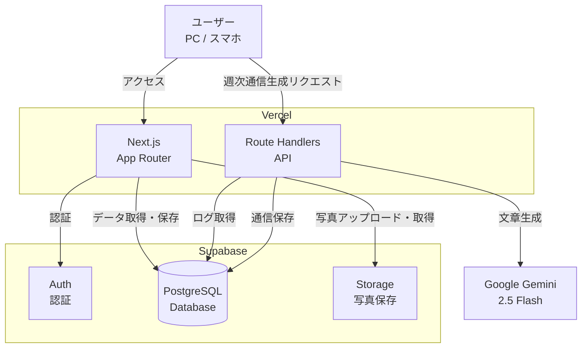
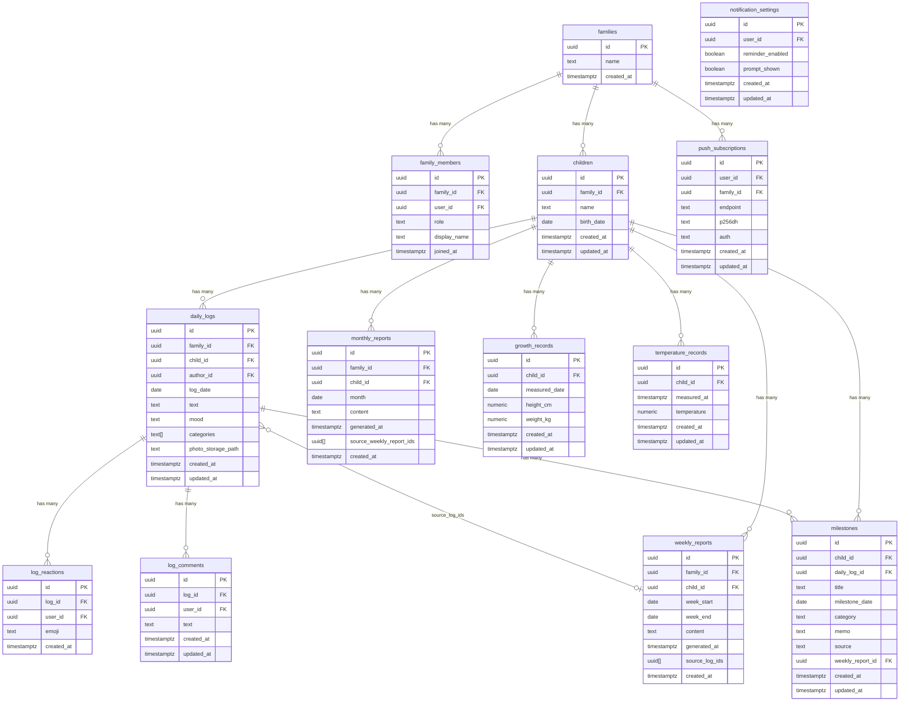
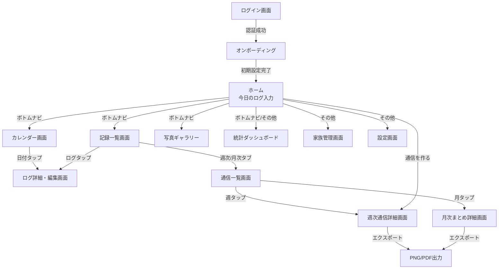
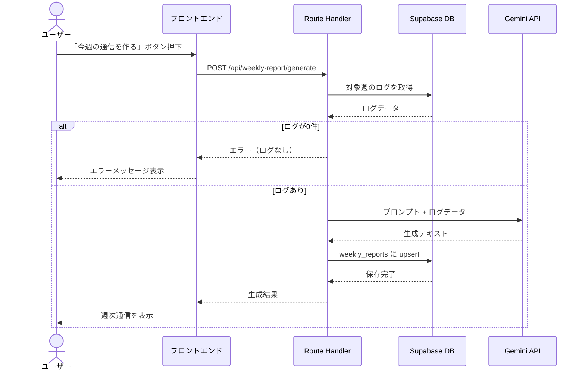

# 機能設計書

## 1. システム構成図



---

## 2. データモデル定義

### 2.1 ER図



### 2.2 テーブル詳細

#### children

| カラム | 型 | NULL | デフォルト | 備考 |
|--------|-----|------|-----------|------|
| id | uuid | NOT NULL | gen_random_uuid() | PK |
| family_id | uuid | NOT NULL | | FK → families |
| name | text | NULL | | 子供の名前 |
| birth_date | date | NULL | | 生年月日 |
| created_at | timestamptz | NOT NULL | now() | |
| updated_at | timestamptz | NOT NULL | now() | |

- インデックス: (family_id)
- RLS: family_id がユーザーの所属する家族と一致

#### daily_logs

| カラム | 型 | NULL | デフォルト | 備考 |
|--------|-----|------|-----------|------|
| id | uuid | NOT NULL | gen_random_uuid() | PK |
| family_id | uuid | NOT NULL | | FK → families |
| child_id | uuid | NOT NULL | | FK → children（対象の子供） |
| author_id | uuid | NOT NULL | auth.uid() | FK → auth.users |
| log_date | date | NOT NULL | CURRENT_DATE | ログ対象日 |
| text | text | NOT NULL | | フリーテキスト |
| mood | text | NOT NULL | | moved / happy / neutral / tired / sad |
| categories | text[] | NULL | '{}' | カテゴリ配列 |
| photo_storage_path | text | NULL | | Storage上のパス |
| created_at | timestamptz | NOT NULL | now() | |
| updated_at | timestamptz | NOT NULL | now() | |

- インデックス: (family_id, log_date), (child_id)
- RLS: family_id がユーザーの所属する家族と一致

#### weekly_reports

| カラム | 型 | NULL | デフォルト | 備考 |
|--------|-----|------|-----------|------|
| id | uuid | NOT NULL | gen_random_uuid() | PK |
| family_id | uuid | NOT NULL | | FK → families |
| child_id | uuid | NOT NULL | | FK → children（対象の子供） |
| week_start | date | NOT NULL | | 月曜日 |
| week_end | date | NOT NULL | | 日曜日 |
| content | text | NOT NULL | | 生成された通信本文 |
| generated_at | timestamptz | NOT NULL | now() | 生成日時 |
| source_log_ids | uuid[] | NULL | '{}' | 元ログID配列 |
| created_at | timestamptz | NOT NULL | now() | |

- ユニーク制約: (family_id, child_id, week_start)
- インデックス: (family_id, child_id, week_start)
- RLS: family_id がユーザーの所属する家族と一致

#### monthly_reports

| カラム | 型 | NULL | デフォルト | 備考 |
|--------|-----|------|-----------|------|
| id | uuid | NOT NULL | gen_random_uuid() | PK |
| family_id | uuid | NOT NULL | | FK → families |
| child_id | uuid | NOT NULL | | FK → children（対象の子供） |
| month | date | NOT NULL | | 対象月 |
| content | text | NOT NULL | | 生成された月次まとめ本文 |
| generated_at | timestamptz | NOT NULL | now() | 生成日時 |
| source_weekly_report_ids | uuid[] | NULL | '{}' | 元週次通信ID配列 |
| created_at | timestamptz | NOT NULL | now() | |

- ユニーク制約: (family_id, child_id, month)
- RLS: family_id がユーザーの所属する家族と一致

#### log_reactions

| カラム | 型 | NULL | デフォルト | 備考 |
|--------|-----|------|-----------|------|
| id | uuid | NOT NULL | gen_random_uuid() | PK |
| log_id | uuid | NOT NULL | | FK → daily_logs（ON DELETE CASCADE） |
| user_id | uuid | NOT NULL | | FK → auth.users |
| emoji | text | NOT NULL | | リアクション絵文字 |
| created_at | timestamptz | NOT NULL | now() | |

- ユニーク制約: (log_id, user_id, emoji)
- RLS: 家族スコープ（daily_logs 経由で family_id を参照）

#### log_comments

| カラム | 型 | NULL | デフォルト | 備考 |
|--------|-----|------|-----------|------|
| id | uuid | NOT NULL | gen_random_uuid() | PK |
| log_id | uuid | NOT NULL | | FK → daily_logs（ON DELETE CASCADE） |
| user_id | uuid | NOT NULL | | FK → auth.users |
| text | text | NOT NULL | | コメント本文（1〜100文字） |
| created_at | timestamptz | NOT NULL | now() | |
| updated_at | timestamptz | NOT NULL | now() | |

- CHECK制約: char_length(text) <= 100, char_length(trim(text)) > 0
- RLS: 家族スコープ（daily_logs 経由で family_id を参照）
- トリガー: updated_at 自動更新

#### growth_records

| カラム | 型 | NULL | デフォルト | 備考 |
|--------|-----|------|-----------|------|
| id | uuid | NOT NULL | gen_random_uuid() | PK |
| child_id | uuid | NOT NULL | | FK → children |
| measured_date | date | NOT NULL | | 計測日 |
| height_cm | numeric | NULL | | 身長（cm） |
| weight_kg | numeric | NULL | | 体重（kg） |
| created_at | timestamptz | NOT NULL | now() | |
| updated_at | timestamptz | NOT NULL | now() | |

- インデックス: (child_id, measured_date)
- RLS: children 経由で family_id = my_family_id()

#### temperature_records

| カラム | 型 | NULL | デフォルト | 備考 |
|--------|-----|------|-----------|------|
| id | uuid | NOT NULL | gen_random_uuid() | PK |
| child_id | uuid | NOT NULL | | FK → children（ON DELETE CASCADE） |
| measured_at | timestamptz | NOT NULL | | 計測日時 |
| temperature | numeric(3,1) | NOT NULL | | 体温（℃） |
| created_at | timestamptz | NOT NULL | now() | |
| updated_at | timestamptz | NOT NULL | now() | |

- CHECK制約: temperature >= 34.0 AND temperature <= 42.0
- インデックス: (child_id, measured_at)
- RLS: children 経由で family_id = my_family_id()

#### push_subscriptions

| カラム | 型 | NULL | デフォルト | 備考 |
|--------|-----|------|-----------|------|
| id | uuid | NOT NULL | gen_random_uuid() | PK |
| user_id | uuid | NOT NULL | | FK → auth.users（ON DELETE CASCADE） |
| family_id | uuid | NOT NULL | | FK → families（ON DELETE CASCADE） |
| endpoint | text | NOT NULL | | Push Subscription endpoint（UNIQUE） |
| p256dh | text | NOT NULL | | 公開鍵 |
| auth | text | NOT NULL | | 認証シークレット |
| created_at | timestamptz | NOT NULL | now() | |
| updated_at | timestamptz | NOT NULL | now() | |

- UNIQUE制約: endpoint
- RLS: user_id = auth.uid()

#### notification_settings

| カラム | 型 | NULL | デフォルト | 備考 |
|--------|-----|------|-----------|------|
| id | uuid | NOT NULL | gen_random_uuid() | PK |
| user_id | uuid | NOT NULL | | FK → auth.users（ON DELETE CASCADE, UNIQUE） |
| reminder_enabled | boolean | NOT NULL | false | リマインダーON/OFF |
| prompt_shown | boolean | NOT NULL | false | ダイアログ表示済みフラグ |
| created_at | timestamptz | NOT NULL | now() | |
| updated_at | timestamptz | NOT NULL | now() | |

- UNIQUE制約: user_id
- RLS: user_id = auth.uid()

#### milestones

| カラム | 型 | NULL | デフォルト | 備考 |
|--------|-----|------|-----------|------|
| id | uuid | NOT NULL | gen_random_uuid() | PK |
| child_id | uuid | NOT NULL | | FK → children |
| daily_log_id | uuid | NULL | | FK → daily_logs（ログから登録時に紐付け） |
| title | text | NOT NULL | | マイルストーンタイトル |
| milestone_date | date | NOT NULL | | 達成日 |
| category | text | NOT NULL | 'other' | motor / language / eating / lifestyle / other |
| memo | text | NULL | | 補足メモ |
| source | text | NOT NULL | 'manual' | manual / ai |
| weekly_report_id | uuid | NULL | | FK → weekly_reports（AI抽出元） |
| created_at | timestamptz | NOT NULL | now() | |
| updated_at | timestamptz | NOT NULL | now() | |

- インデックス: (child_id, milestone_date)
- RLS: children 経由で family_id = my_family_id()

---

## 3. RLS（Row Level Security）ポリシー

全テーブルで `my_family_id()` 関数を使用した家族単位のアクセス制御を実施。

```sql
CREATE FUNCTION my_family_id() RETURNS uuid AS $$
  SELECT family_id FROM family_members WHERE user_id = auth.uid() LIMIT 1;
$$ LANGUAGE sql SECURITY DEFINER STABLE;
```

### daily_logs

| 操作 | ポリシー名 | 条件 |
|------|-----------|------|
| SELECT | select_family_logs | family_id = my_family_id() |
| INSERT | insert_family_logs | family_id = my_family_id() AND author_id = auth.uid() |
| UPDATE | update_own_logs | author_id = auth.uid() |
| DELETE | delete_own_logs | author_id = auth.uid() |

### weekly_reports

| 操作 | ポリシー名 | 条件 |
|------|-----------|------|
| SELECT | select_family_reports | family_id = my_family_id() |
| INSERT | insert_family_reports | family_id = my_family_id() |
| UPDATE | update_family_reports | family_id = my_family_id() |

### monthly_reports

| 操作 | ポリシー名 | 条件 |
|------|-----------|------|
| SELECT | select_family_reports | family_id = my_family_id() |
| INSERT | insert_family_reports | family_id = my_family_id() |
| UPDATE | update_family_reports | family_id = my_family_id() |

### log_reactions

| 操作 | ポリシー名 | 条件 |
|------|-----------|------|
| SELECT | select_family_reactions | daily_logs JOIN で family_id = my_family_id() |
| INSERT | insert_own_reactions | user_id = auth.uid() AND daily_logs JOIN で family_id = my_family_id() |
| DELETE | delete_own_reactions | user_id = auth.uid() |

### log_comments

| 操作 | ポリシー名 | 条件 |
|------|-----------|------|
| SELECT | select_family_comments | daily_logs JOIN で family_id = my_family_id() |
| INSERT | insert_own_comment | user_id = auth.uid() AND daily_logs JOIN で family_id = my_family_id() |
| UPDATE | update_own_comment | user_id = auth.uid() |
| DELETE | delete_own_comment | user_id = auth.uid() |

### growth_records

| 操作 | ポリシー名 | 条件 |
|------|-----------|------|
| SELECT | select_family_growth | children JOIN で family_id = my_family_id() |
| INSERT | insert_family_growth | children JOIN で family_id = my_family_id() |
| UPDATE | update_family_growth | children JOIN で family_id = my_family_id() |
| DELETE | delete_family_growth | children JOIN で family_id = my_family_id() |

### temperature_records

| 操作 | ポリシー名 | 条件 |
|------|-----------|------|
| SELECT | select_family_temperature | children JOIN で family_id = my_family_id() |
| INSERT | insert_family_temperature | children JOIN で family_id = my_family_id() |
| UPDATE | update_family_temperature | children JOIN で family_id = my_family_id() |
| DELETE | delete_family_temperature | children JOIN で family_id = my_family_id() |

### milestones

| 操作 | ポリシー名 | 条件 |
|------|-----------|------|
| SELECT | select_family_milestones | children JOIN で family_id = my_family_id() |
| INSERT | insert_family_milestones | children JOIN で family_id = my_family_id() |
| UPDATE | update_family_milestones | children JOIN で family_id = my_family_id() |
| DELETE | delete_family_milestones | children JOIN で family_id = my_family_id() |

### push_subscriptions

| 操作 | ポリシー名 | 条件 |
|------|-----------|------|
| ALL | 自分の購読を管理 | user_id = auth.uid() |

### notification_settings

| 操作 | ポリシー名 | 条件 |
|------|-----------|------|
| ALL | 自分の設定を管理 | user_id = auth.uid() |

### Storage (log-photos バケット)

| 操作 | 条件 |
|------|------|
| SELECT | パスが `logs/{auth.uid()}/` で始まる |
| INSERT | パスが `logs/{auth.uid()}/` で始まる |
| DELETE | パスが `logs/{auth.uid()}/` で始まる |

---

## 4. API設計

### 4.1 日次ログ API（Supabase Client 直接操作）

クライアントから Supabase Client SDK を使って直接操作する。Route Handlers は使用しない。

| 操作 | メソッド | 対象テーブル |
|------|---------|-------------|
| ログ作成 | supabase.from('daily_logs').insert() | daily_logs |
| ログ一覧取得 | supabase.from('daily_logs').select().eq('log_date', date) | daily_logs |
| ログ更新 | supabase.from('daily_logs').update().eq('id', id) | daily_logs |
| ログ削除 | supabase.from('daily_logs').delete().eq('id', id) | daily_logs |

### 4.2 写真 API（Supabase Client 直接操作）

| 操作 | メソッド |
|------|---------|
| アップロード | supabase.storage.from('log-photos').upload(path, file) |
| URL取得 | supabase.storage.from('log-photos').getPublicUrl(path) |
| 削除 | supabase.storage.from('log-photos').remove([path]) |

### 4.3 週次通信 API（Route Handlers）

#### POST /api/weekly-report/generate

週次通信を生成する。

**リクエスト:**

```json
{
  "childId": "uuid",
  "weekStart": "2026-02-16",
  "weekEnd": "2026-02-22"
}
```

**処理フロー:**

1. 認証チェック（Supabase Auth セッション検証）
2. 指定された child_id の対象期間のログを取得
3. ログが0件の場合はエラーを返す
4. Gemini API にプロンプト + ログデータを送信
5. 生成結果を weekly_reports に upsert（child_id + week_start で上書き）
6. 生成結果を返す

**レスポンス（成功）:**

```json
{
  "id": "uuid",
  "weekStart": "2026-02-16",
  "weekEnd": "2026-02-22",
  "content": "📮 今週のすくすく日記（2026/02/16〜2026/02/22）...",
  "generatedAt": "2026-02-22T21:00:00Z"
}
```

**レスポンス（エラー）:**

```json
{
  "error": "対象期間のログがありません"
}
```

#### GET /api/weekly-report

週次通信の一覧・個別取得はSupabase Client で直接操作する。

| 操作 | メソッド |
|------|---------|
| 一覧取得 | supabase.from('weekly_reports').select().order('week_start', { ascending: false }) |
| 個別取得 | supabase.from('weekly_reports').select().eq('id', id).single() |

### 4.4 月次まとめ API（Route Handlers）

#### POST /api/monthly-report/generate

月次まとめを生成する。対象月の週次通信をもとにAIで月単位の振り返りを生成。

**リクエスト:**

```json
{
  "childId": "uuid",
  "month": "2026-02"
}
```

### 4.5 家族 API（Route Handlers）

| エンドポイント | メソッド | 用途 |
|---------------|---------|------|
| /api/family/create | POST | 家族グループ作成 |
| /api/family/invite | POST | 招待リンク生成 |
| /api/family/join | POST | 招待受け入れ |
| /api/family/members | GET | メンバー一覧取得 |
| /api/family/members/[userId] | PATCH/DELETE | メンバー操作 |

### 4.6 リアクション API（Supabase Client 直接操作）

| 操作 | メソッド |
|------|---------|
| リアクション追加 | supabase.from('log_reactions').insert({ log_id, user_id, emoji }) |
| リアクション削除 | supabase.from('log_reactions').delete().match({ log_id, user_id, emoji }) |
| 一覧取得 | supabase.from('log_reactions').select().in('log_id', logIds) |

---

## 5. 画面遷移図



---

## 6. 画面設計（ワイヤフレーム）

### 6.1 ログイン画面

```
┌─────────────────────────────┐
│                             │
│       すくすく日記           │
│                             │
│  ┌───────────────────────┐  │
│  │ メールアドレス         │  │
│  └───────────────────────┘  │
│  ┌───────────────────────┐  │
│  │ パスワード             │  │
│  └───────────────────────┘  │
│                             │
│  ┌───────────────────────┐  │
│  │    ログイン            │  │
│  └───────────────────────┘  │
│                             │
│  ┌───────────────────────┐  │
│  │  G  Googleでログイン   │  │
│  └───────────────────────┘  │
│                             │
│  アカウント登録はこちら      │
│                             │
└─────────────────────────────┘
```

### 6.2 ホーム画面（今日のログ入力）

```
┌─────────────────────────────┐
│ すくすく日記    [ログ] [通信] │
├─────────────────────────────┤
│                             │
│ 📅 2026年2月18日（水）       │
│                             │
│ 今日の気分                   │
│ [🙂] [😐] [😭]              │
│                             │
│ 今日の出来事                 │
│ ┌───────────────────────┐   │
│ │                       │   │
│ │                       │   │
│ │                       │   │
│ └───────────────────────┘   │
│                             │
│ カテゴリ                     │
│ [食事] [睡眠] [遊び] [ことば]│
│ [運動] [体調] [成長] [気持ち]│
│                             │
│ 写真                        │
│ [📷 写真を追加]              │
│                             │
│ ┌───────────────────────┐   │
│ │       保存する          │   │
│ └───────────────────────┘   │
│                             │
│ ── 今日のログ ──            │
│ ┌───────────────────────┐   │
│ │ 🙂 離乳食をよく食べた… │   │
│ └───────────────────────┘   │
│                             │
└─────────────────────────────┘
```

### 6.3 ログ一覧画面

```
┌─────────────────────────────┐
│ ← ログ一覧                  │
├─────────────────────────────┤
│                             │
│ 2026年2月                   │
│                             │
│ ┌───────────────────────┐   │
│ │ 2/18（水） 🙂          │   │
│ │ 離乳食をよく食べた…    │   │
│ │ [食事] [成長]          │   │
│ └───────────────────────┘   │
│ ┌───────────────────────┐   │
│ │ 2/17（火） 😐          │   │
│ │ 夜泣きがひどかった…    │   │
│ │ [睡眠] [体調]          │   │
│ └───────────────────────┘   │
│ ┌───────────────────────┐   │
│ │ 2/16（月） 🙂          │   │
│ │ 初めて「ママ」と言った… │   │
│ │ [ことば] [成長]        │   │
│ └───────────────────────┘   │
│                             │
│ ...                         │
│                             │
└─────────────────────────────┘
```

### 6.4 週次通信詳細画面

```
┌─────────────────────────────┐
│ ← 週次通信                  │
├─────────────────────────────┤
│                             │
│ 📮 今週のすくすく日記        │
│ 2026/02/10〜2026/02/16      │
│                             │
│ 今週は離乳食デビューの       │
│ 大きな一歩がありました…     │
│                             │
│ 🌱 成長のきざし              │
│ ・初めてスプーンを自分で…   │
│ ・寝返りが上手に…           │
│                             │
│ 😊 かわいかった瞬間          │
│ ・パパの顔を見て…           │
│                             │
│ 🫧 ちょっと大変だったこと    │
│ ・夜泣きが続いて…           │
│                             │
│ 🧡 パパ/ママのひとこと       │
│ 大変だけど、笑顔に救われる   │
│ 毎日です。                  │
│                             │
│ ── この週の写真 ──          │
│ ┌─────┐ ┌─────┐ ┌─────┐   │
│ │ 📷  │ │ 📷  │ │ 📷  │   │
│ └─────┘ └─────┘ └─────┘   │
│                             │
│ ┌───────────────────────┐   │
│ │     再生成する          │   │
│ └───────────────────────┘   │
│                             │
└─────────────────────────────┘
```

### 6.5 週次通信一覧画面

```
┌─────────────────────────────┐
│ ← 週次通信一覧              │
├─────────────────────────────┤
│                             │
│ ┌───────────────────────┐   │
│ │ 📮 2/10〜2/16          │   │
│ │ 離乳食デビューの週…    │   │
│ └───────────────────────┘   │
│ ┌───────────────────────┐   │
│ │ 📮 2/3〜2/9            │   │
│ │ 寝返りマスターの週…    │   │
│ └───────────────────────┘   │
│ ┌───────────────────────┐   │
│ │ 📮 1/27〜2/2           │   │
│ │ 初めての笑い声の週…    │   │
│ └───────────────────────┘   │
│                             │
│ ...                         │
│                             │
└─────────────────────────────┘
```

---

## 7. コンポーネント設計

### 7.1 主要コンポーネント

```
app/
├── (auth)/
│   ├── login/page.tsx          # ログイン画面
│   ├── signup/page.tsx         # アカウント登録画面
│   └── onboarding/page.tsx     # オンボーディング（家族・子供初期設定）
├── (main)/
│   ├── layout.tsx              # メインレイアウト（ヘッダー・ナビ）
│   ├── page.tsx                # ホーム（今日のログ入力）
│   ├── calendar/page.tsx       # カレンダー画面
│   ├── logs/page.tsx           # 記録一覧画面（ログ・週次・月次タブ）
│   ├── gallery/page.tsx        # 写真ギャラリー画面
│   ├── stats/page.tsx          # 統計ダッシュボード画面
│   ├── family/page.tsx         # 家族管理画面
│   ├── settings/page.tsx       # 設定画面
│   └── weekly/
│       ├── page.tsx            # 週次通信一覧画面（リダイレクト）
│       ├── [id]/page.tsx       # 週次通信詳細画面
│       └── monthly/
│           └── [id]/page.tsx   # 月次まとめ詳細画面
├── invite/
│   └── [token]/page.tsx        # 家族招待受け入れ画面
└── api/
    ├── weekly-report/
    │   └── generate/route.ts   # 週次通信生成 API
    ├── monthly-report/
    │   └── generate/route.ts   # 月次まとめ生成 API
    └── family/
        ├── create/route.ts     # 家族作成 API
        ├── invite/route.ts     # 招待リンク生成 API
        ├── join/route.ts       # 家族参加 API
        └── members/
            ├── route.ts        # メンバー一覧 API
            └── [userId]/route.ts # メンバー操作 API
```

### 7.2 共通コンポーネント

| コンポーネント | 配置 | 用途 |
|---------------|------|------|
| MoodSelector | `log/` | 気分スタンプ選択（🥰🙂😐😴😭） |
| CategoryPicker | `log/` | カテゴリ複数選択 |
| PhotoUploader | `log/` | 写真アップロード（プレビュー付き） |
| LogCard | `log/` | ログ一覧のカード表示（リアクションバー付き） |
| LogForm | `log/` | ログ入力・編集フォーム |
| LogFilter | `log/` | ログ絞り込み（気分・カテゴリ・テキスト・子供） |
| LogsTabs | `log/` | 記録一覧のタブ切り替え（ログ・週次・月次） |
| ReactionBar | `log/` | スタンプリアクション表示・トグル操作 |
| CommentSection | `log/` | コメント一覧 + 入力欄 |
| CommentItem | `log/` | 個別コメント表示・編集・削除 |
| AuthorBadge | `log/` | 記録者の表示名バッジ |
| ChildSelector | `child/` | 子供選択（複数子供時にフォーム上部に表示） |
| ChildBadge | `child/` | 子供名バッジ（記録カードに表示） |
| WeeklyReportCard | `weekly/` | 週次通信一覧のカード表示 |
| PhotoGallery | `weekly/` | 写真一覧表示（週次通信詳細用） |
| MonthlyReportCard | `monthly/` | 月次まとめ一覧のカード表示 |
| MonthlyPhotoGallery | `monthly/` | 月次写真一覧表示 |
| CalendarGrid | `calendar/` | カレンダーグリッド表示 |
| MonthPicker | `calendar/` | 月選択ピッカー |
| PhotoGrid | `gallery/` | 写真ギャラリーのグリッド表示 |
| PhotoModal | `gallery/` | 写真拡大モーダル |
| MoodChart | `stats/` | 記録数・気分分布の積み上げ棒グラフ |
| CategoryPieChart | `stats/` | カテゴリ別割合の円グラフ |
| PeriodTabs | `stats/` | 統計の期間切り替えタブ |
| GrowthChart | `stats/` | 身長・体重成長曲線グラフ |
| MilestoneTimeline | `stats/` | マイルストーン時系列タイムライン |
| MemoriesSection | `memory/` | ○年前の今日セクション |
| MemoryCard | `memory/` | 過去の記録カード |
| ReactionNotice | `home/` | リアクション・コメント新着通知 |
| InviteLink | `family/` | 招待リンク生成・共有 |
| MemberList | `family/` | 家族メンバー一覧 |
| ExportLayout | `export/` | エクスポート用専用レイアウト |
| ShareMenu | `export/` | 共有メニュー（PNG/PDF選択） |
| Header | `layout/` | デスクトップヘッダー |
| Nav | `layout/` | デスクトップナビゲーション |
| BottomNav | `layout/` | モバイルボトムナビゲーション |

---

## 8. 週次通信生成フロー



---

## 9. v2 機能設計（実装済み）

### 9.1 写真ギャラリー

記録に添付された写真を一覧で振り返れる専用ページ。

- **画面**: `/gallery`
- **表示形式**: 月別のグリッドレイアウト（3列）
- **データソース**: `daily_logs` の `photo_storage_path` が存在するレコードを対象
- **操作**: 写真タップで拡大モーダル表示
- **フィルター**: 月切り替え（前後ナビゲーション）、子供切り替え
- **コンポーネント**: `PhotoGrid`, `PhotoModal`
- **ロジック**: `lib/gallery.ts`

### 9.2 過去の振り返り — ○年前の今日

ホーム画面に「○年前の今日」の記録を表示し、成長の実感と感動を提供する。

- **表示場所**: ホーム画面の今日のログ一覧の下部
- **データソース**: `daily_logs` から過去の同月同日のレコードを取得
- **表示条件**: 1年以上前の同日にログが存在する場合のみ表示
- **表示内容**: テキスト・気分・写真（あれば）をカード形式で表示
- **複数年**: 1年前、2年前…と複数年分がある場合はすべて表示
- **コンポーネント**: `MemoriesSection`, `MemoryCard`
- **ロジック**: `lib/memories.ts`

### 9.3 統計ダッシュボード

記録データを可視化し、育児の傾向と成長を実感できるダッシュボード。

- **画面**: `/stats`
- **グラフ種類**:
  - 記録数・気分分布の積み上げ棒グラフ（「記録の様子」）— 1つのグラフで記録数と気分の内訳を同時表示
  - カテゴリ別の記録割合（円グラフ）
- **期間**: 月/週単位で切り替え、前後ナビゲーション
- **フィルター**: 子供切り替え（複数子供時）
- **ライブラリ**: Recharts
- **コンポーネント**: `MoodChart`, `CategoryPieChart`, `PeriodTabs`
- **ロジック**: `lib/stats.ts`

### 9.4 家族間のリアクション

記録に対して家族メンバーがスタンプリアクションを残せる機能。

- **リアクション種類**: 固定5種のスタンプ
  - ❤️ いいね / 👏 すごい！ / 😊 ほっこり / 💪 おつかれさま / ✨ キラキラ
- **操作**: スタンプタップでトグル（追加/削除）。楽観的UIで即時反映
- **データモデル**: `log_reactions` テーブル（log_id, user_id, emoji, UNIQUE制約）
- **表示**: LogCard の下部にリアクションバーを常時表示。リアクション済みのスタンプはハイライト、リアクターの表示名を表示
- **通知**: ホーム画面にリアクション新着通知バナー（localStorage で最終確認時刻を管理）
- **コンポーネント**: `ReactionBar`, `ReactionNotice`
- **ロジック**: `lib/reactions.ts`

### 9.5 通信のPDF / 画像エクスポート

週次・月次通信をPDFや画像としてエクスポートし、共有・印刷できる機能。

- **エクスポート形式**: PNG（高解像度 2x）、PDF（A4縦）
- **生成方式**: クライアントサイドで `html-to-image` + `jsPDF` を使用（動的インポートでコード分割）
- **UI**: 通信詳細画面に共有ボタン → ドロップダウンメニューでPNG/PDF選択
- **レイアウト**: 専用の `ExportLayout` コンポーネント（800px固定幅、インラインスタイル）。通信本文 + 写真グリッド（3列）+ ヘッダー/フッター
- **コンポーネント**: `ExportLayout`, `ShareMenu`
- **ロジック**: `lib/export.ts`

### 9.6 モバイルナビゲーション改善

モバイルのボトムバーに「その他」メニューを追加し、統計・家族・設定・ログアウトへの導線を確保する。

- **ボトムバー構成**: 今日 / カレンダー / 記録 / 写真 / その他（5項目）
- **「その他」メニュー**: タップでポップアップメニューを展開
  - 統計 / 家族 / 設定 / ログアウト
- **デスクトップ**: 既存のヘッダー構成を維持（変更なし）

---

## 10. v3 機能設計（概要）

v3 で追加予定の機能の概要設計。各機能の詳細設計は実装時にステアリングドキュメントで定義する。

### 10.1 身長・体重記録（優先度1）

子供の身長・体重を定期的に記録し、成長曲線で可視化する。

- **データモデル**: `growth_records` テーブル（child_id, measured_date, height_cm, weight_kg）
- **入力UI**: 子供プロフィールまたは専用画面から記録（日次ログとは独立）
- **表示**: 統計ダッシュボードに成長曲線グラフを追加。母子手帳の標準成長曲線と重ねて表示
- **入力頻度**: 月1〜2回程度を想定
- **カテゴリ「成長」との棲み分け**: カテゴリは日記のテキスト分類、身長・体重は定量データとして独立管理

### 10.2 週次通信カスタマイズ（優先度2）

AI生成の週次通信をユーザーの好みに合わせてカスタマイズできる機能。

- **文体・トーン設定**: 感動系（デフォルト）/ ユーモア系 / 淡々系 から選択
- **セクション構成**: 不要なセクションの非表示設定
- **部分再生成**: 「ここを直して」の指示で特定セクションのみ再生成
- **設定保存**: 家族単位で設定を保存（全通信に適用）
- **API料金影響**: Gemini 2.5 Flash は1回あたり約0.1円以下のため、カスタマイズによる追加コストは無視できるレベル

### 10.3 成長タイムライン（優先度3・実装済み）

子供ごとの「初めて○○した」マイルストーンを時系列で表示する。

- **入力方式**:
  - 日次ログ入力時に「はじめてできたこと」トグルで同時登録（`daily_log_id` で紐付け）
  - AI自動抽出（週次通信生成時にマイルストーンを検出、`weekly_report_id` で紐付け）
- **データモデル**: `milestones` テーブル（child_id, daily_log_id, title, milestone_date, category, memo, source, weekly_report_id）
- **カテゴリ**: motor（運動）/ language（ことば）/ eating（食事）/ lifestyle（生活習慣）/ other（その他）
- **表示**:
  - ログカード: マイルストーンが紐づくログにバッジ表示
  - 統計ページ: 成長タブ内の小項目タブ「初めての出来事」にタイムライン表示
- **AI抽出ロジック**: 週次通信生成プロンプトに「初めて」系イベントの検出を追加。検出結果を自動保存
- **手動操作**: ユーザーがマイルストーンの編集・削除可能

### 10.4 家族コメント ✅ 実装済み（v3.4）

リアクション（スタンプ）に加えて、短文コメントを残せる機能。

- **コメント仕様**: 1コメントあたり最大100文字の短文。Zodバリデーション + DB CHECK制約
- **データモデル**: `log_comments` テーブル（log_id, user_id, text, created_at, updated_at）。ON DELETE CASCADE
- **表示**: LogCard のリアクションバー下部にコメント一覧をインライン表示
- **操作**: コメント入力フィールド + 送信ボタン。自分のコメントは編集・削除可能（三点メニュー）
- **楽観的UI**: 追加・編集・削除すべて楽観的更新。エラー時はロールバック
- **通知**: リアクション通知と統合。ホーム画面に「○件のリアクション・○件のコメント」表示。localStorage で `lastCommentCheckedAt` を管理

### 10.5 記録リマインダー（優先度5）

その日に記録がない場合、21時（日本時間）にプッシュ通知を送る。

- **実装方式**: PWA Web Push（Service Worker + Push API）
- **通知条件**: 当日の `daily_logs` が0件の場合のみ送信
- **通知時刻**: 21:00 JST 固定
- **通知内容**: 「今日まだ日記がありません。今日の出来事を残しませんか？」
- **オプトイン**: 初回利用時に通知許可を求める。設定画面でON/OFF切り替え可能
- **バックエンド**: Supabase Edge Functions または外部cron（Vercel Cron）で定期実行

---

## 11. v4 機能設計（概要）

v4 で追加予定の機能の概要設計。各機能の詳細設計は実装時にステアリングドキュメントで定義する。

### 11.1 音声入力（優先度1）

マイクボタンから音声で日記を入力し、文字起こしでテキスト化する。

- **目的**: 入力負担の最小化。授乳中・寝かしつけ中など両手がふさがる場面での記録を可能にする
- **入力UI**: ホーム画面のテキスト入力欄にマイクボタンを追加。タップで録音開始、もう一度タップで停止
- **文字起こし**: 音声をテキストに変換し、フリーテキスト欄に挿入
- **技術選定**: Web Speech API / Whisper API / Gemini Audio 等（ステアリングで決定）
- **対象画面**: ホーム画面（日次ログ入力）、ログ編集画面
- **フォールバック**: 音声認識非対応ブラウザではマイクボタンを非表示

### 11.2 年次アルバム自動生成（優先度2）

1年分の記録データからAIで年間ダイジェストを生成し、PDF/画像で出力する。

- **データソース**: 週次通信、月次まとめ、写真、マイルストーン、成長データ（身長・体重）
- **生成内容**: 月ごとのハイライト + ベスト写真 + マイルストーンまとめ + 成長データサマリー + 1年の総括メッセージ
- **出力形式**: PDF（A4複数ページ）、画像（複数枚）
- **生成タイミング**: ユーザー操作（ボタン押下）による生成。対象年を選択
- **API**: Route Handler 経由で Gemini に年間データを送信し、構造化されたダイジェストを生成
- **表示**: 通信一覧画面または専用画面に年次アルバムセクションを追加

### 11.3 睡眠・食事かんたんトラッキング（優先度3）

体温記録と同様のクイック入力UIで、睡眠時間・食事量をワンタップ記録する。

- **睡眠記録**: 就寝時刻・起床時刻の入力、または合計睡眠時間の直接入力。夜間覚醒回数（任意）
- **食事記録**: 食事タイプ（朝食/昼食/夕食/おやつ/ミルク）× 量（完食/半分/少し）のシンプル選択
- **データモデル**: `sleep_records`, `meal_records` テーブル（体温記録と同パターン）
- **入力UI**: 今日ページにクイック入力セクションを追加（体温と並列）
- **統計**: 統計ダッシュボードに睡眠時間推移グラフ、食事量推移グラフを追加
- **週次通信連携**: 睡眠・食事データも週次通信生成時のコンテキストに含める
